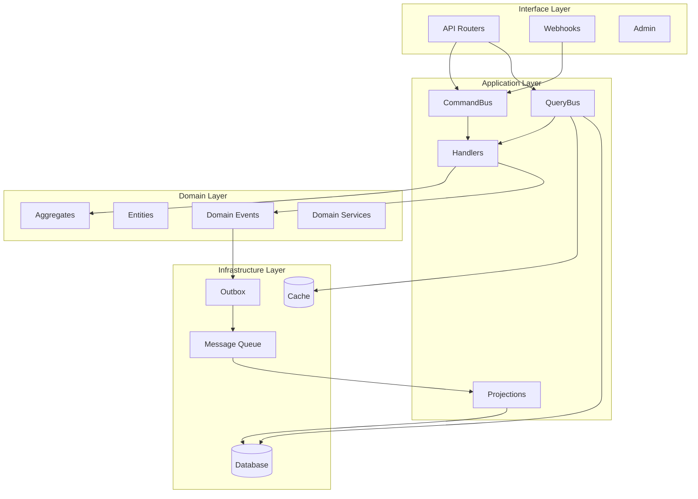

# C4 Component Diagram

## API Component View

## Components

### Interface Layer
- **API Routers**: FastAPI route handlers
- **Webhooks**: Inbound/outbound webhook handlers
- **Admin**: Administrative endpoints

### Application Layer
- **CommandBus**: Dispatches write operations
- **QueryBus**: Dispatches read operations with caching
- **Handlers**: Command and query handlers
- **Projections**: Event handlers for read models

### Domain Layer
- **Aggregates**: Domain aggregate roots
- **Entities**: Domain entities
- **Events**: Domain events
- **Services**: Domain services

### Infrastructure Layer
- **Database**: PostgreSQL persistence
- **Cache**: Redis caching
- **Message Queue**: Event messaging
- **Outbox**: Transactional outbox pattern
