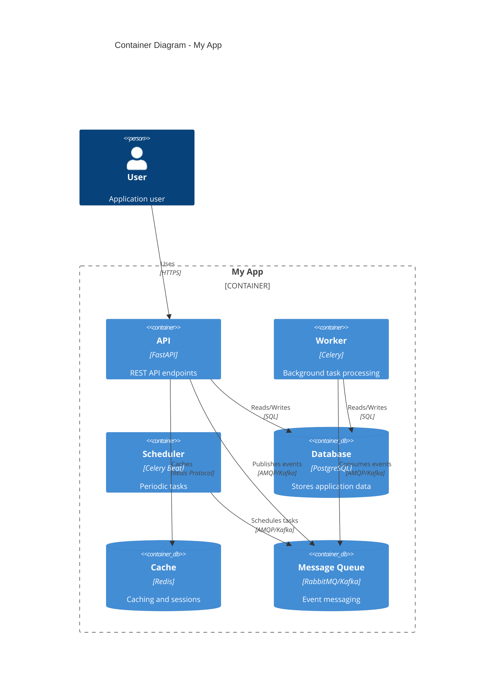

# C4 Container Diagram

## Container View

## Containers

| Container | Technology | Purpose |
|-----------|------------|---------|
| API | FastAPI | REST API endpoints |
| Worker | Celery | Background task processing |
| Scheduler | Celery Beat | Periodic task scheduling |
| Database | PostgreSQL | Primary data store |
| Cache | Redis | Caching and rate limiting |
| Message Queue | RabbitMQ/Kafka | Event-driven messaging |
