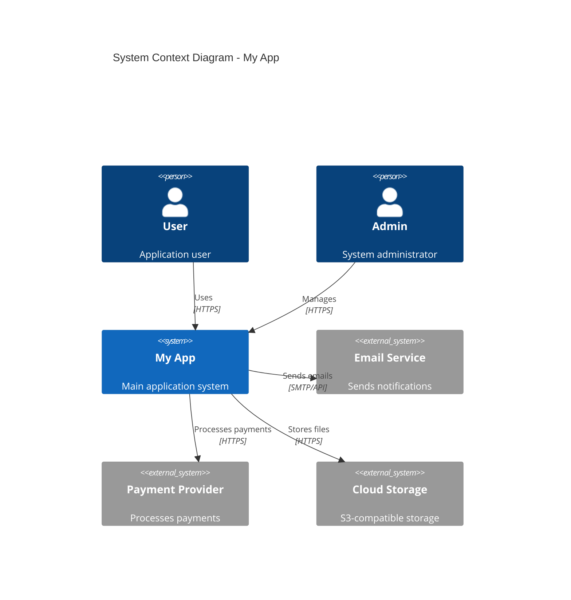

# C4 Context Diagram

## System Context

## Description

The My App system provides a REST API for users and administrators. It integrates with external services for email notifications, payment processing, and file storage.
