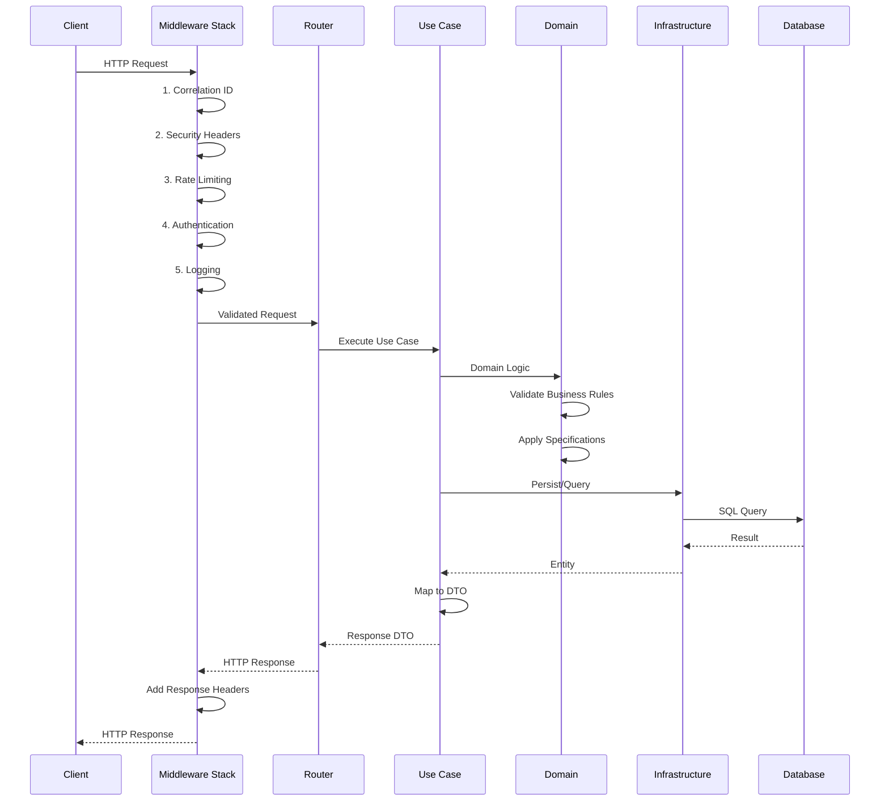
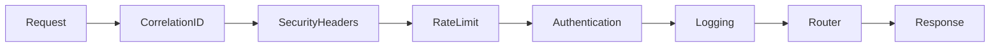
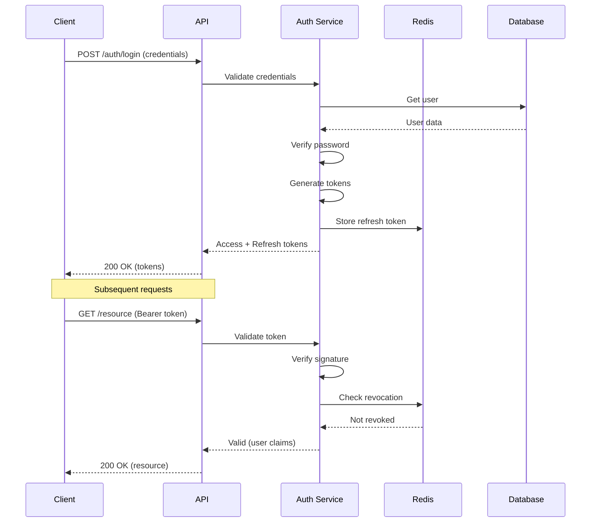
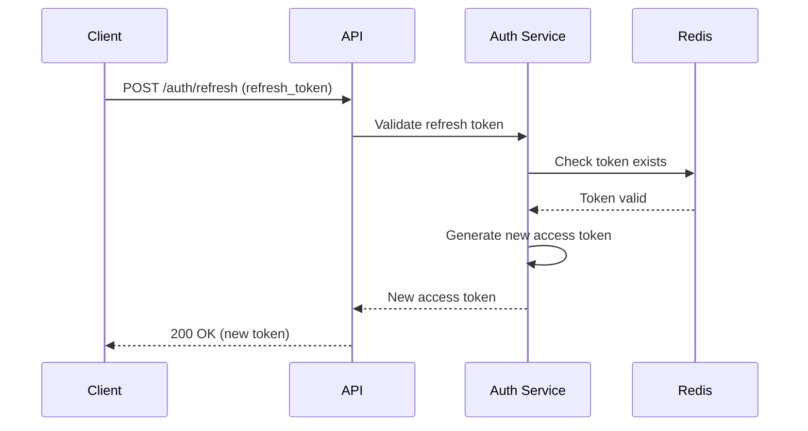
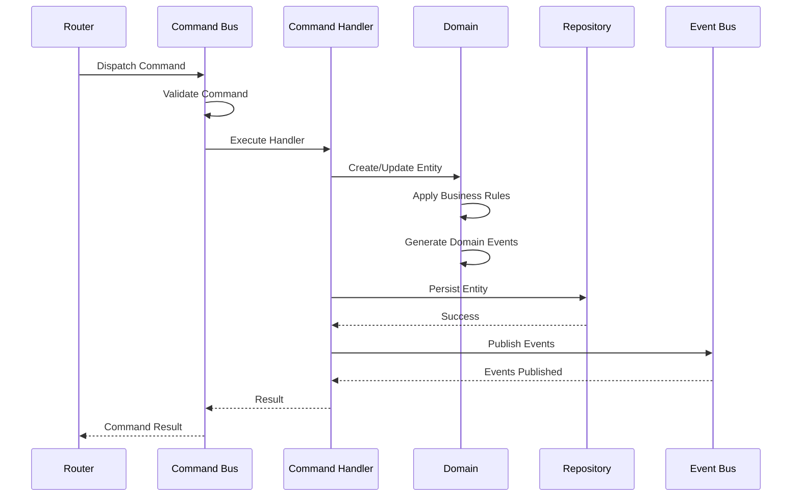
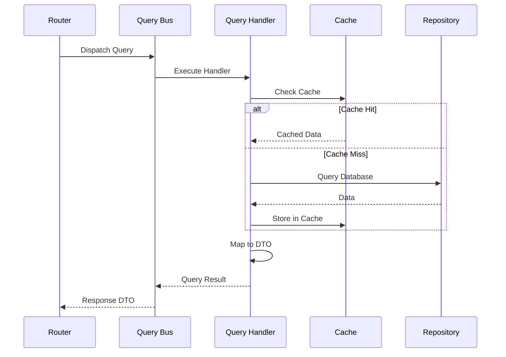
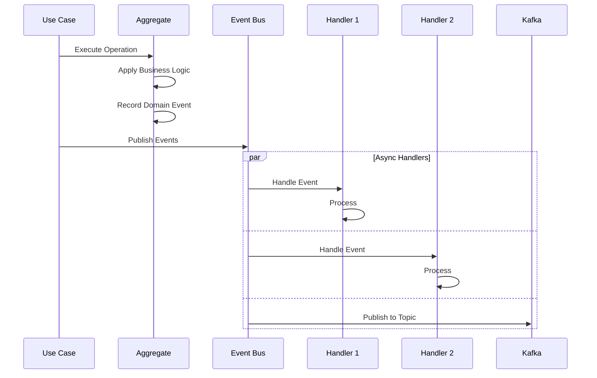
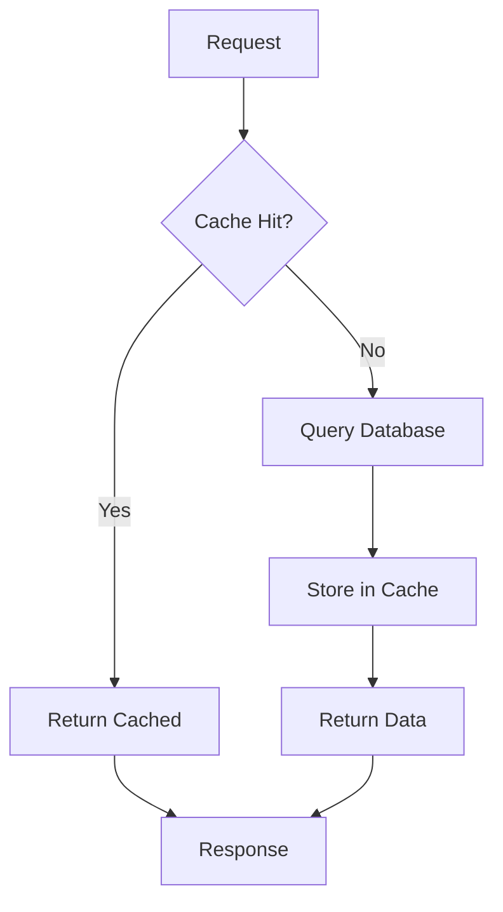
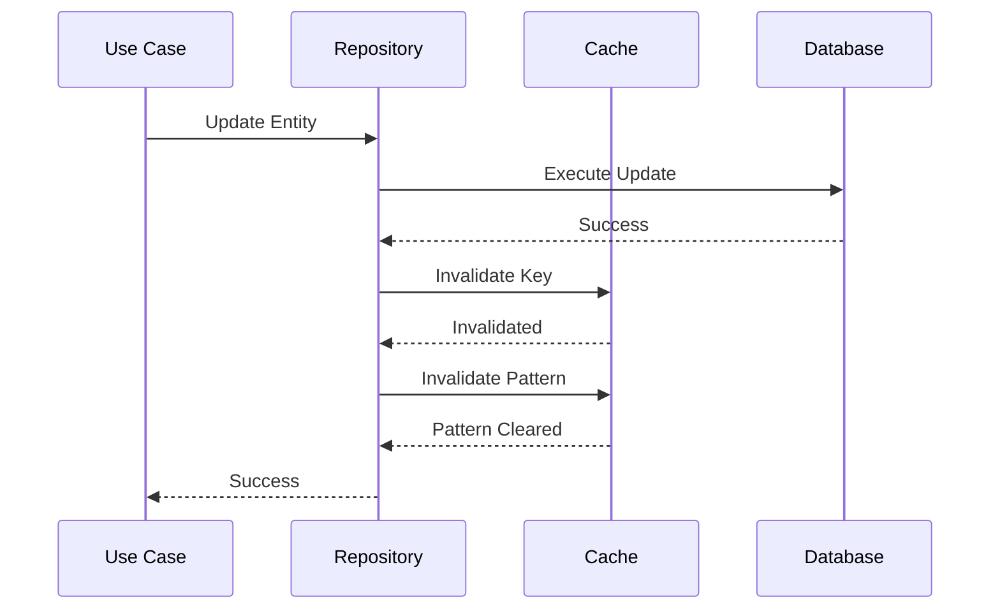
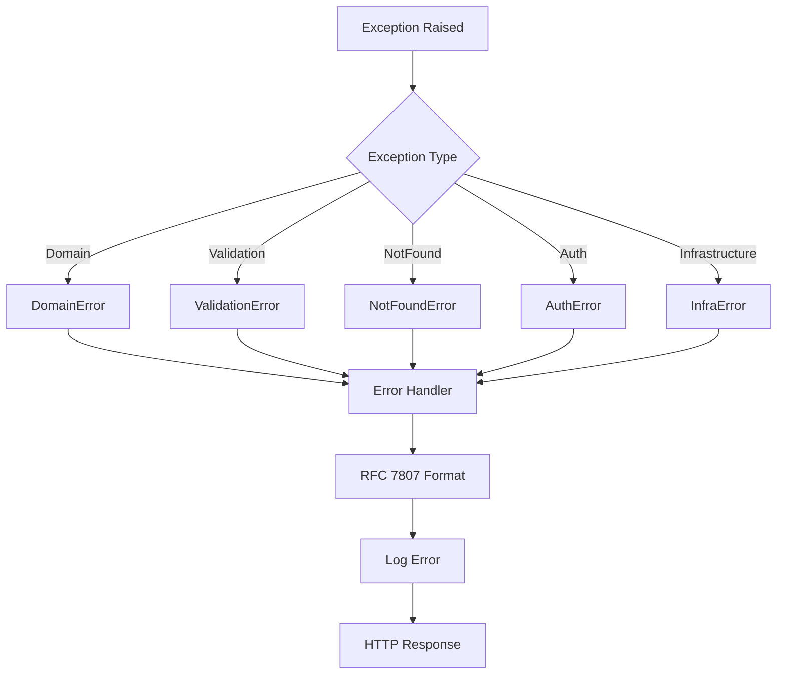

# Data Flows

## Request Flow

### HTTP Request Lifecycle

### Middleware Execution Order

## Authentication Flow

### JWT Authentication

### Token Refresh Flow

## CQRS Flow

### Command Flow

### Query Flow

## Domain Event Flow

## Cache Flow

### Cache-Aside Pattern

### Cache Invalidation

## Error Flow

## Related Documentation

- [C4 Model](c4-model.md)
- [Dependencies](dependencies.md)
- [Error Handling](../layers/interface/error-handling.md)
