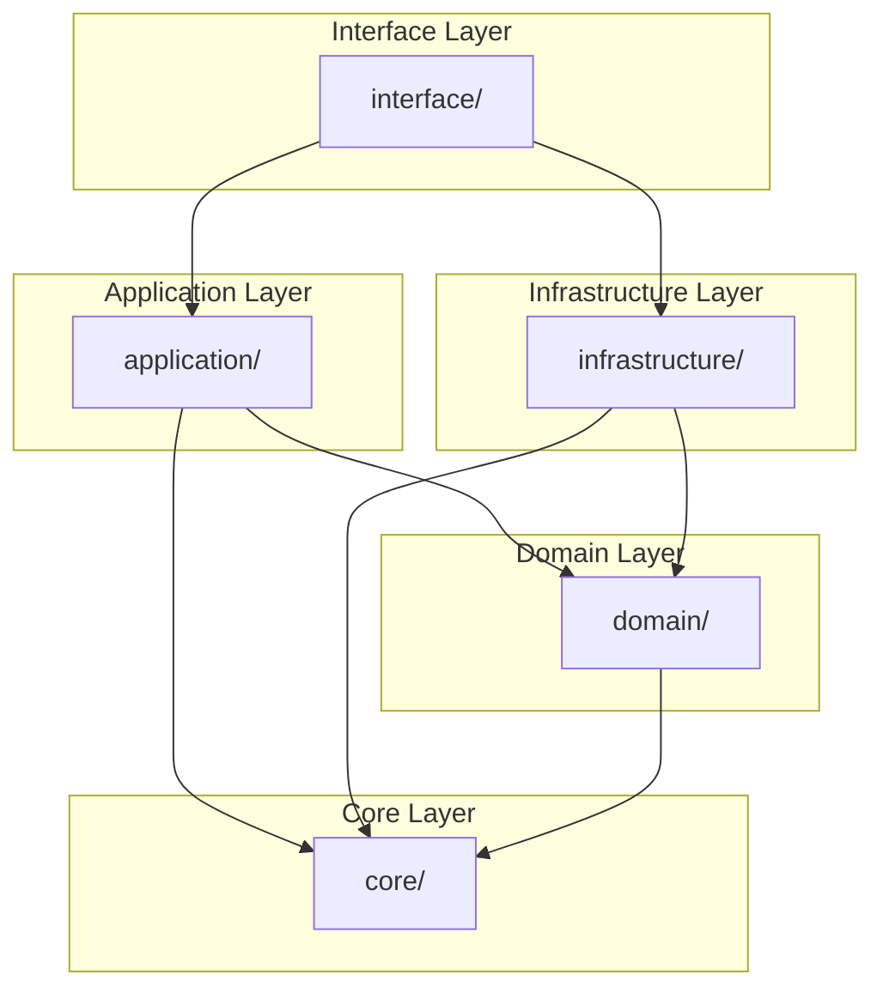

# Dependencies

## Module Dependency Graph



## Inter-Layer Dependencies

### Core Layer Dependencies

```
src/core/
├── base/          → (no internal dependencies)
├── config/        → base/
├── di/            → config/, protocols/
├── errors/        → (no internal dependencies)
├── protocols/     → types/
├── shared/        → config/, types/
└── types/         → (no internal dependencies)
```

### Domain Layer Dependencies

```
src/domain/
├── common/        → core/protocols, core/types
├── users/         → common/, core/base
├── items/         → common/, core/base
└── examples/      → common/, core/base
```

### Application Layer Dependencies

```
src/application/
├── common/        → core/base, domain/common
├── services/      → core/protocols, domain/
├── users/         → common/, domain/users
├── items/         → common/, domain/items
└── examples/      → common/, domain/examples
```

### Infrastructure Layer Dependencies

```
src/infrastructure/
├── db/            → core/config, domain/
├── cache/         → core/config, core/protocols
├── auth/          → core/config, core/types
├── kafka/         → core/config
├── redis/         → core/config
├── resilience/    → core/config
├── observability/ → core/config
└── ...
```

### Interface Layer Dependencies

```
src/interface/
├── v1/            → application/, infrastructure/auth
├── v2/            → application/, infrastructure/auth
├── graphql/       → application/
├── websocket/     → application/
├── middleware/    → infrastructure/
└── errors/        → core/errors
```

## External Dependencies

### Core Dependencies

| Package | Version | Purpose |
|---------|---------|---------|
| pydantic | 2.9+ | Data validation and settings |
| pydantic-settings | 2.0+ | Configuration management |

### Web Framework

| Package | Version | Purpose |
|---------|---------|---------|
| fastapi | 0.115+ | Web framework |
| uvicorn | 0.30+ | ASGI server |
| starlette | 0.40+ | ASGI toolkit |

### Database

| Package | Version | Purpose |
|---------|---------|---------|
| sqlalchemy | 2.0+ | ORM and database toolkit |
| sqlmodel | 0.0.22+ | SQLAlchemy + Pydantic integration |
| asyncpg | 0.29+ | PostgreSQL async driver |
| alembic | 1.13+ | Database migrations |

### Cache & Messaging

| Package | Version | Purpose |
|---------|---------|---------|
| redis | 5.0+ | Redis client |
| aiokafka | 0.10+ | Kafka async client |
| aio-pika | 9.0+ | RabbitMQ async client |

### Authentication

| Package | Version | Purpose |
|---------|---------|---------|
| python-jose | 3.3+ | JWT handling |
| passlib | 1.7+ | Password hashing |
| argon2-cffi | 23.0+ | Argon2 password hashing |

### Observability

| Package | Version | Purpose |
|---------|---------|---------|
| opentelemetry-api | 1.28+ | Telemetry API |
| opentelemetry-sdk | 1.28+ | Telemetry SDK |
| structlog | 24.0+ | Structured logging |
| prometheus-client | 0.20+ | Prometheus metrics |

### Testing

| Package | Version | Purpose |
|---------|---------|---------|
| pytest | 8.3+ | Testing framework |
| pytest-asyncio | 0.24+ | Async test support |
| hypothesis | 6.115+ | Property-based testing |
| polyfactory | 2.17+ | Test data generation |
| httpx | 0.27+ | HTTP client for testing |

### Storage

| Package | Version | Purpose |
|---------|---------|---------|
| minio | 7.2+ | MinIO/S3 client |
| elasticsearch | 8.0+ | Elasticsearch client |

## Dependency Rules

### Allowed Dependencies

| Layer | Can Depend On |
|-------|---------------|
| Core | External packages only |
| Domain | Core |
| Application | Core, Domain |
| Infrastructure | Core, Domain, Application |
| Interface | All layers |

### Forbidden Dependencies

| Layer | Cannot Depend On |
|-------|------------------|
| Core | Domain, Application, Infrastructure, Interface |
| Domain | Application, Infrastructure, Interface |
| Application | Infrastructure, Interface |
| Infrastructure | Interface |

## Dependency Injection

The system uses a custom DI container for managing dependencies:

```python
# Registration
container.register(IRepository, SQLAlchemyRepository)
container.register(ICacheProvider, RedisCacheProvider)

# Resolution
repository = container.resolve(IRepository)
```

## Related Documentation

- [C4 Model](c4-model.md)
- [Data Flows](data-flows.md)
- [Dependency Injection](../layers/core/dependency-injection.md)
