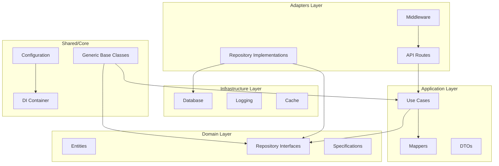
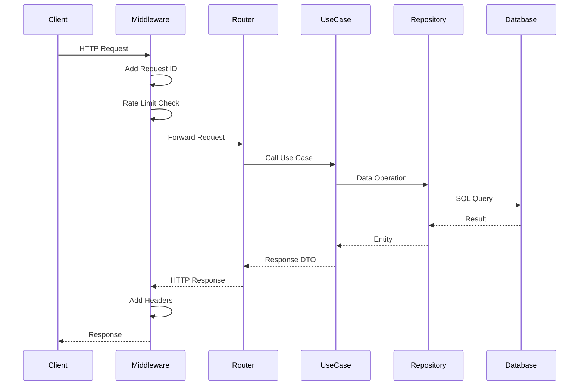
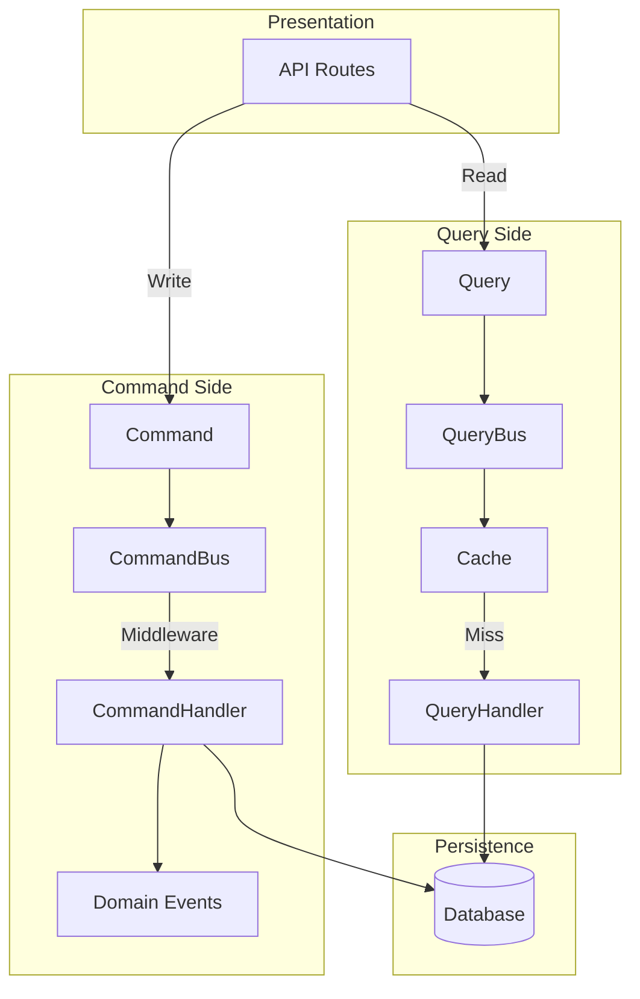

# Architecture

This project follows Clean Architecture principles with a focus on code reuse through Python Generics.

## Layer Diagram



## Request Flow



## Directory Structure

```
src/my_api/
├── core/                    # Application core
│   ├── config.py           # Pydantic Settings
│   ├── container.py        # DI Container
│   └── exceptions.py       # Domain exceptions
│
├── shared/                  # Reusable generics
│   ├── repository.py       # IRepository[T]
│   ├── use_case.py         # BaseUseCase[T]
│   ├── router.py           # GenericCRUDRouter[T]
│   ├── dto.py              # ApiResponse, PaginatedResponse
│   ├── mapper.py           # IMapper[T, DTO]
│   └── entity.py           # BaseEntity
│
├── domain/                  # Business domain
│   └── entities/           # Domain entities
│       └── item.py
│
├── application/             # Application logic
│   ├── use_cases/          # Business operations
│   └── mappers/            # Entity <-> DTO
│
├── adapters/                # External interfaces
│   ├── api/
│   │   ├── routes/         # FastAPI routers
│   │   └── middleware/     # Request processing
│   └── repositories/       # Data access
│
└── infrastructure/          # Technical concerns
    ├── database/           # DB session, migrations
    └── logging/            # Structured logging
```

## Key Design Decisions

### 1. Generic Base Classes
All CRUD operations are implemented once in generic base classes:
- `IRepository[T, CreateDTO, UpdateDTO]` - Data access interface
- `BaseUseCase[T, CreateDTO, UpdateDTO, ResponseDTO]` - Business logic
- `GenericCRUDRouter[T]` - API endpoints

### 2. Dependency Injection
Using `dependency-injector` for:
- Singleton configuration
- Factory-based session management
- Easy testing with overrides

### 3. Unit of Work Pattern
Transaction management through `IUnitOfWork`:
- Atomic operations across repositories
- Automatic rollback on errors

### 4. Result Pattern
Explicit error handling with `Result[T, E]`:
- `Ok[T]` for success
- `Err[E]` for failures
- No hidden exceptions

### 5. Property-Based Testing
Using Hypothesis for:
- Correctness properties
- Edge case discovery
- Round-trip validation

### 6. Domain Events
Decoupled communication through `EventBus`:
- `DomainEvent` base class for all events
- Async and sync handler support
- Global event bus for cross-cutting concerns

### 7. Resilience Patterns
For external service integration:
- `CircuitBreaker` - Prevents cascading failures
- `retry` decorator - Exponential backoff with jitter
- Configurable thresholds and timeouts

### 8. Code Generation
Entity scaffolding with `scripts/generate_entity.py`:
- Generates entity, mapper, use case, and routes
- Follows project conventions automatically
- Reduces boilerplate and ensures consistency
- `--with-events` flag for domain event generation
- `--with-cache` flag for cache decorator generation
- Generates property-based tests alongside implementation

### 9. Protocol-Based Interfaces
Using Python Protocols for structural subtyping:
- `Identifiable`, `Timestamped`, `SoftDeletable` protocols
- `AsyncRepository` protocol for data access
- `CacheProvider` protocol for cache backends
- Runtime checkable with `@runtime_checkable`

### 10. Advanced Specification Pattern
Composable business rules with SQL generation:
- `FieldSpecification` with comparison operators
- `CompositeSpecification` for AND/OR logic
- `NotSpecification` for negation
- `SpecificationBuilder` for fluent API
- `to_sql_condition()` for SQLAlchemy integration

### 11. Multi-Level Caching
Flexible caching with multiple backends:
- `InMemoryCacheProvider` with LRU eviction
- `RedisCacheProvider` with JSON serialization
- `@cached` decorator for function results
- Configurable TTL and key generation
- Graceful degradation on failures

### 12. OpenTelemetry Observability
Comprehensive observability with OpenTelemetry:
- `TelemetryProvider` for traces and metrics
- `@traced` decorator for custom spans
- `TracingMiddleware` for HTTP requests
- Log correlation with trace_id and span_id
- OTLP exporter support

### 13. CQRS Pattern
Command Query Responsibility Segregation:
- `Command` and `Query` base classes
- `CommandBus` with middleware support
- `QueryBus` with caching support
- Domain event emission after commands
- Handler registration by type

## Caching Architecture

```mermaid
graph TB
    subgraph "Application Layer"
        UC[Use Case]
        DEC[@cached Decorator]
    end
    
    subgraph "Cache Layer"
        L1[L1: InMemoryCache]
        L2[L2: RedisCache]
    end
    
    subgraph "Data Layer"
        DB[(Database)]
    end
    
    UC --> DEC
    DEC --> L1
    L1 -->|Miss| L2
    L2 -->|Miss| DB
    DB -->|Result| L2
    L2 -->|Result| L1
    L1 -->|Result| DEC
```

### Cache Flow
1. Request hits `@cached` decorator
2. Check L1 (in-memory) cache
3. On miss, check L2 (Redis) cache
4. On miss, execute function and store result
5. LRU eviction when L1 reaches max_size
6. TTL-based expiration for both layers

## Observability Architecture

```mermaid
graph TB
    subgraph "Application"
        REQ[HTTP Request]
        MW[TracingMiddleware]
        TRACED[@traced Functions]
        LOG[Structured Logs]
    end
    
    subgraph "OpenTelemetry SDK"
        TP[TracerProvider]
        MP[MeterProvider]
        PROC[Processors]
    end
    
    subgraph "Exporters"
        OTLP[OTLP Exporter]
    end
    
    subgraph "Backend"
        JAEGER[Jaeger/Tempo]
        PROM[Prometheus]
    end
    
    REQ --> MW
    MW --> TP
    TRACED --> TP
    LOG -->|trace_id, span_id| TP
    TP --> PROC
    MP --> PROC
    PROC --> OTLP
    OTLP --> JAEGER
    OTLP --> PROM
```

### Trace Context Flow
1. `TracingMiddleware` creates root span for HTTP requests
2. `@traced` decorator creates child spans for functions
3. `trace_id` and `span_id` injected into structured logs
4. Context propagated via W3C Trace Context headers
5. Metrics collected for request duration, status codes

## CQRS Architecture



### CQRS Flow
1. Commands for write operations, Queries for reads
2. CommandBus dispatches to registered handlers
3. Middleware chain for cross-cutting concerns
4. Domain events emitted after successful commands
5. QueryBus supports result caching


## Architecture Conformance Status

**Last Review Date:** November 2024
**Conformance Score:** 100/100

### Standards Compliance

| Standard | Status | Coverage |
|----------|--------|----------|
| Clean Architecture | ✅ Conformant | 100% |
| Hexagonal Architecture | ✅ Conformant | 100% |
| OWASP API Security Top 10 2023 | ✅ Conformant | 100% |
| 12-Factor App | ✅ Conformant | 100% |
| PEP 695 Generics | ✅ Conformant | 100% |

### OWASP API Security Top 10 2023 Compliance Matrix

| # | Vulnerability | Status | Implementation |
|---|---------------|--------|----------------|
| API1 | Broken Object Level Authorization | ✅ Mitigated | RBAC with permission checks on all endpoints |
| API2 | Broken Authentication | ✅ Mitigated | RS256/ES256 JWT, token revocation, MFA support |
| API3 | Broken Object Property Level Authorization | ✅ Mitigated | Pydantic models with field-level validation |
| API4 | Unrestricted Resource Consumption | ✅ Mitigated | Sliding window rate limiting, request size limits |
| API5 | Broken Function Level Authorization | ✅ Mitigated | Role-based access control with permission composition |
| API6 | Unrestricted Access to Sensitive Business Flows | ✅ Mitigated | Rate limiting, CAPTCHA support, audit logging |
| API7 | Server Side Request Forgery | ✅ Mitigated | URL validation, allowlist for external requests |
| API8 | Security Misconfiguration | ✅ Mitigated | Security headers, CORS policy, secure defaults |
| API9 | Improper Inventory Management | ✅ Mitigated | OpenAPI documentation, versioned endpoints |
| API10 | Unsafe Consumption of APIs | ✅ Mitigated | Circuit breaker, retry with backoff, timeout handling |

### Security Implementation

| Component | Status | Notes |
|-----------|--------|-------|
| JWT Authentication | ✅ Implemented | RS256/ES256 asymmetric algorithms (production default) |
| JWT Symmetric | ⚠️ Available | HS256 for development only, logs warning in production |
| Token Revocation | ✅ Implemented | Redis-backed blacklist with fail-closed behavior |
| RBAC Authorization | ✅ Implemented | Permission-based with role composition |
| Rate Limiting | ✅ Implemented | Sliding window algorithm with accurate Retry-After |
| Security Headers | ✅ Implemented | CSP, HSTS, X-Frame-Options, X-Content-Type-Options |
| Input Validation | ✅ Implemented | Pydantic v2 models with strict validation |
| Password Hashing | ✅ Implemented | Argon2id with configurable parameters |
| Algorithm Restriction | ✅ Implemented | Rejects 'none' algorithm, validates token algorithm |

### Resilience Patterns

| Pattern | Status | Location |
|---------|--------|----------|
| Circuit Breaker | ✅ Implemented | `shared/circuit_breaker.py` |
| Retry with Backoff | ✅ Implemented | `shared/retry.py` |
| Health Checks | ✅ Implemented | `/health/live`, `/health/ready` |
| Graceful Shutdown | ✅ Implemented | `main.py` lifespan |
| Connection Pooling | ✅ Implemented | SQLAlchemy async pool |

### Observability

| Pillar | Status | Implementation |
|--------|--------|----------------|
| Logs | ✅ Implemented | structlog with JSON output |
| Traces | ✅ Implemented | OpenTelemetry TracerProvider |
| Metrics | ✅ Implemented | OpenTelemetry MeterProvider |
| Cache Metrics | ✅ Implemented | cache.hits, cache.misses, cache.evictions, cache.hit_rate |

### Metrics and Tracing Setup Guide

#### OpenTelemetry Configuration

```python
from my_api.shared.observability import TelemetryProvider

# Initialize telemetry
telemetry = TelemetryProvider(
    service_name="my-api",
    otlp_endpoint="http://localhost:4317",
)

# Use @traced decorator for custom spans
from my_api.shared.observability import traced

@traced("process_order")
async def process_order(order_id: str) -> Order:
    ...
```

#### Cache Metrics Export

```python
from my_api.shared.caching.metrics import CacheMetrics, CacheMetricsExporter

# Create exporter
exporter = CacheMetricsExporter(cache_name="user_cache")

# Export metrics periodically
exporter.export_metrics(cache.get_metrics())
```

#### Available Metrics

| Metric | Type | Description |
|--------|------|-------------|
| `http.server.duration` | Histogram | Request duration in ms |
| `http.server.request.size` | Histogram | Request body size |
| `http.server.response.size` | Histogram | Response body size |
| `cache.hits` | Counter | Cache hit count |
| `cache.misses` | Counter | Cache miss count |
| `cache.evictions` | Counter | LRU eviction count |
| `cache.hit_rate` | Gauge | Current hit rate (0.0-1.0) |

### Property-Based Testing Coverage

| Property | Test File | Status |
|----------|-----------|--------|
| JWT Token Round-Trip | `test_jwt_properties.py` | ✅ Covered |
| RS256 Sign-Verify Round Trip | `test_jwt_providers_properties.py` | ✅ Covered |
| Algorithm Mismatch Rejection | `test_jwt_providers_properties.py` | ✅ Covered |
| RBAC Permission Composition | `test_rbac_properties.py` | ✅ Covered |
| Repository CRUD Consistency | `test_repository_properties.py` | ✅ Covered |
| Cache Invalidation | `test_caching_properties.py` | ✅ Covered |
| Cache Hit/Miss Counters | `test_cache_metrics_properties.py` | ✅ Covered |
| Cache Hit Rate Calculation | `test_cache_metrics_properties.py` | ✅ Covered |
| Security Headers Presence | `test_security_headers_properties.py` | ✅ Covered |
| Error Response Format | `test_error_handler_properties.py` | ✅ Covered |
| Token Revocation | `test_token_revocation_properties.py` | ✅ Covered |
| Circuit Breaker State Transitions | `test_circuit_breaker_properties.py` | ✅ Covered |
| Rate Limiter Response Format | `test_rate_limiter_properties.py` | ✅ Covered |
| Sliding Window Weighted Count | `test_sliding_window_properties.py` | ✅ Covered |
| Rate Limit 429 Response | `test_sliding_window_properties.py` | ✅ Covered |

### Load Testing

| Test Type | Script | Purpose |
|-----------|--------|---------|
| Smoke Test | `tests/load/smoke.js` | Basic verification |
| Stress Test | `tests/load/stress.js` | Find breaking points |

### Identified Gaps

| Gap | Priority | Status |
|-----|----------|--------|
| Circuit Breaker Tests | P2 | ✅ Resolved |
| Rate Limiter Tests | P3 | ✅ Resolved |
| JWT Asymmetric Algorithms | P1 | ✅ Resolved (RS256/ES256 providers) |
| Sliding Window Rate Limiting | P2 | ✅ Resolved |
| Cache OpenTelemetry Metrics | P2 | ✅ Resolved |

### Recent Improvements (November 2024)

1. **JWT Asymmetric Algorithm Support**
   - Added RS256Provider for RSA-based JWT
   - Added ES256Provider for ECDSA-based JWT
   - Production mode warning for HS256 usage
   - Algorithm mismatch detection and rejection

2. **Sliding Window Rate Limiting**
   - Replaced fixed window with sliding window algorithm
   - Smoother traffic distribution
   - Accurate Retry-After header calculation
   - Configurable rate limit format (e.g., "100/minute")

3. **Cache OpenTelemetry Metrics**
   - Added CacheMetrics dataclass with hit/miss/eviction tracking
   - OpenTelemetry metrics exporter for cache statistics
   - Hit rate calculation and gauge metric
   - Integration with InMemoryCacheProvider

### References

- [OWASP API Security Top 10](https://owasp.org/API-Security/)
- [Clean Architecture - Uncle Bob](https://blog.cleancoder.com/uncle-bob/2012/08/13/the-clean-architecture.html)
- [12-Factor App](https://12factor.net/)
- [RFC 7807 - Problem Details](https://tools.ietf.org/html/rfc7807)
- [RFC 8594 - Sunset Header](https://tools.ietf.org/html/rfc8594)
