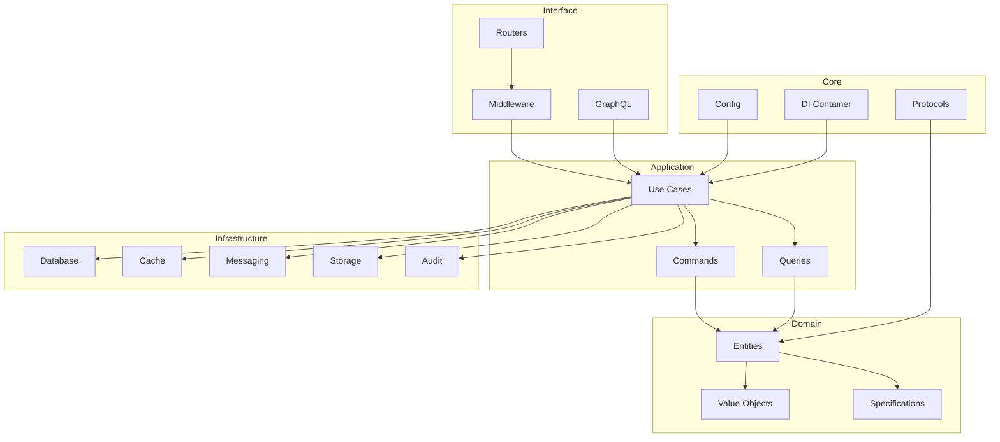

# Componentes do Sistema

## Visão Geral dos Componentes

Este documento detalha todos os componentes principais do Python API Base, suas responsabilidades e interfaces.

## 1. Core Components

### 1.1 Configuration System

**Localização:** `src/core/config/`

O sistema de configuração utiliza Pydantic Settings para validação e carregamento de configurações.

```python
# Estrutura de configuração
Settings
├── DatabaseSettings      # Conexão com banco de dados
├── SecuritySettings      # JWT, CORS, Rate Limiting
├── RedisSettings         # Cache e token storage
└── ObservabilitySettings # Logging, Tracing, Metrics
```

#### DatabaseSettings

| Campo | Tipo | Default | Descrição |
|-------|------|---------|-----------|
| `url` | `str` | - | Connection string PostgreSQL |
| `pool_size` | `int` | 10 | Tamanho do pool de conexões |
| `max_overflow` | `int` | 20 | Conexões extras permitidas |
| `pool_timeout` | `int` | 30 | Timeout para obter conexão |

#### SecuritySettings

| Campo | Tipo | Default | Descrição |
|-------|------|---------|-----------|
| `secret_key` | `SecretStr` | - | Chave para assinatura JWT (min 32 chars) |
| `cors_origins` | `list[str]` | `["*"]` | Origens CORS permitidas |
| `rate_limit` | `str` | `"100/minute"` | Limite de requisições |
| `algorithm` | `str` | `"HS256"` | Algoritmo JWT |
| `access_token_expire_minutes` | `int` | 30 | Expiração do access token |

#### ObservabilitySettings

| Campo | Tipo | Default | Descrição |
|-------|------|---------|-----------|
| `log_level` | `str` | `"INFO"` | Nível de log |
| `log_format` | `str` | `"json"` | Formato de saída |
| `otlp_endpoint` | `str \| None` | `None` | Endpoint OpenTelemetry |
| `service_name` | `str` | `"python-api-base"` | Nome do serviço |
| `elasticsearch_enabled` | `bool` | `False` | Habilitar ES |
| `kafka_enabled` | `bool` | `False` | Habilitar Kafka |
| `redis_enabled` | `bool` | `False` | Habilitar Redis |
| `minio_enabled` | `bool` | `False` | Habilitar MinIO |

### 1.2 Protocol Definitions

**Localização:** `src/core/protocols/`

Interfaces que definem contratos entre camadas.

```python
# Base Protocols
class Identifiable(Protocol):
    id: str

class Timestamped(Protocol):
    created_at: datetime
    updated_at: datetime | None

class SoftDeletable(Protocol):
    deleted_at: datetime | None
    is_deleted: bool

# Entity Protocols
class Entity(Identifiable, Protocol):
    pass

class TrackedEntity(Entity, Timestamped, Protocol):
    pass

class VersionedEntity(TrackedEntity, Protocol):
    version: int

class FullEntity(VersionedEntity, SoftDeletable, Protocol):
    pass
```

#### Repository Protocol

```python
class AsyncRepository[T, ID](Protocol):
    """Repositório assíncrono genérico."""
    
    async def get(self, id: ID) -> T | None:
        """Busca entidade por ID."""
        ...
    
    async def get_all(
        self,
        skip: int = 0,
        limit: int = 100,
    ) -> list[T]:
        """Lista entidades com paginação."""
        ...
    
    async def create(self, entity: T) -> T:
        """Cria nova entidade."""
        ...
    
    async def update(self, entity: T) -> T:
        """Atualiza entidade existente."""
        ...
    
    async def delete(self, id: ID) -> bool:
        """Remove entidade."""
        ...
    
    async def exists(self, id: ID) -> bool:
        """Verifica existência."""
        ...
```

### 1.3 Error Handling

**Localização:** `src/core/errors/`

Sistema de tratamento de erros seguindo RFC 7807 (Problem Details).

```python
# Estrutura de erro RFC 7807
{
    "type": "https://api.example.com/errors/validation",
    "title": "Validation Error",
    "status": 422,
    "detail": "The request body contains invalid data",
    "instance": "/api/v1/users",
    "errors": [
        {
            "field": "email",
            "message": "Invalid email format"
        }
    ]
}
```

## 2. Domain Components

### 2.1 Specification Pattern

**Localização:** `src/domain/common/specification.py`

Implementação do padrão Specification para regras de negócio composáveis.

```python
# Classes principais
Specification[T]           # Base abstrata
├── AndSpecification[T]    # Combinação AND
├── OrSpecification[T]     # Combinação OR
├── NotSpecification[T]    # Negação
├── PredicateSpecification[T]  # Baseada em função
└── AttributeSpecification[T, V]  # Baseada em atributo
```

#### Operadores de Comparação

```python
class ComparisonOperator(Enum):
    EQ = "eq"           # Igual
    NE = "ne"           # Diferente
    GT = "gt"           # Maior que
    GE = "ge"           # Maior ou igual
    LT = "lt"           # Menor que
    LE = "le"           # Menor ou igual
    CONTAINS = "contains"       # Contém
    STARTS_WITH = "starts_with" # Começa com
    ENDS_WITH = "ends_with"     # Termina com
    IN = "in"           # Está em lista
    IS_NULL = "is_null"         # É nulo
    IS_NOT_NULL = "is_not_null" # Não é nulo
```

#### Funções de Conveniência

```python
# Criação rápida de specifications
equals[T, V](attribute, value)      # Igualdade
not_equals[T, V](attribute, value)  # Diferença
greater_than[T, V](attribute, value) # Maior que
less_than[T, V](attribute, value)   # Menor que
contains[T](attribute, value)       # Contém string
is_null[T](attribute)               # É nulo
is_not_null[T](attribute)           # Não é nulo
```

### 2.2 Value Objects

**Localização:** `src/domain/common/`

Objetos imutáveis que representam conceitos do domínio.

```python
@dataclass(frozen=True, slots=True)
class Email:
    value: str
    
    def __post_init__(self) -> None:
        if not self._is_valid(self.value):
            raise ValueError(f"Invalid email: {self.value}")
    
    @staticmethod
    def _is_valid(email: str) -> bool:
        return "@" in email and "." in email.split("@")[1]

@dataclass(frozen=True, slots=True)
class Money:
    amount: Decimal
    currency: str
    
    def add(self, other: "Money") -> "Money":
        if self.currency != other.currency:
            raise ValueError("Currency mismatch")
        return Money(self.amount + other.amount, self.currency)
```

## 3. Infrastructure Components

### 3.1 Cache System

**Localização:** `src/infrastructure/cache/`

Sistema de cache com múltiplos providers.

```python
# Componentes
CacheProvider[T]      # Protocol base
├── MemoryCacheProvider[T]  # Cache em memória (LRU)
└── RedisCacheProvider[T]   # Cache Redis

# Modelos
CacheKey[T]           # Chave tipada
CacheEntry[T]         # Entrada com TTL
CacheStats            # Estatísticas

# Decorators
@cached(ttl=300)      # Cache automático
```

#### CacheEntry

```python
@dataclass(frozen=True, slots=True)
class CacheEntry[T]:
    key: str
    value: T
    created_at: datetime
    ttl: int | None = None
    expires_at: datetime | None = None
    tags: tuple[str, ...] = ()
    
    @property
    def is_expired(self) -> bool:
        if self.expires_at is None:
            return False
        return datetime.now(UTC) > self.expires_at
```

### 3.2 Resilience Patterns

**Localização:** `src/infrastructure/resilience/`

Padrões de resiliência para tolerância a falhas.

```python
# Padrões disponíveis
CircuitBreaker[TConfig]  # Disjuntor
Retry[T]                 # Retry com backoff
Bulkhead                 # Limitador de concorrência
Timeout                  # Timeout configurável
Fallback                 # Valor fallback
```

#### CircuitBreaker

```python
@dataclass
class CircuitBreakerConfig:
    failure_threshold: int = 5      # Falhas para abrir
    success_threshold: int = 3      # Sucessos para fechar
    timeout: float = 30.0           # Tempo em half-open
    
class CircuitState(Enum):
    CLOSED = "closed"       # Normal
    OPEN = "open"           # Bloqueado
    HALF_OPEN = "half_open" # Testando
```

#### Retry

```python
@dataclass
class RetryConfig:
    max_attempts: int = 3
    base_delay: float = 1.0
    max_delay: float = 60.0
    exponential_base: float = 2.0
    jitter: bool = True
    
class ExponentialBackoff(BackoffStrategy):
    def get_delay(self, attempt: int) -> float:
        delay = self.base_delay * (self.exponential_base ** attempt)
        if self.jitter:
            delay *= random.uniform(0.5, 1.5)
        return min(delay, self.max_delay)
```

### 3.3 Audit System

**Localização:** `src/infrastructure/audit/`

Sistema de auditoria para rastreamento de ações.

```python
@dataclass
class AuditRecord[T]:
    id: str
    action: AuditAction
    entity_type: str
    entity_id: str
    user_id: str | None
    timestamp: datetime
    changes: dict[str, Any]
    metadata: T

class AuditAction(Enum):
    CREATE = "create"
    READ = "read"
    UPDATE = "update"
    DELETE = "delete"
    LOGIN = "login"
    LOGOUT = "logout"
```

### 3.4 Authentication

**Localização:** `src/infrastructure/auth/`

Componentes de autenticação e autorização.

```python
# JWT Service
class JWTService:
    def create_access_token(
        self,
        user_id: str,
        roles: list[str],
        extra_claims: dict | None = None,
    ) -> str: ...
    
    def create_refresh_token(self, user_id: str) -> str: ...
    
    def verify_token(self, token: str) -> TokenPayload: ...

# Password Policy
class PasswordPolicy:
    min_length: int = 12
    require_uppercase: bool = True
    require_lowercase: bool = True
    require_digit: bool = True
    require_special: bool = True
    
    def validate(self, password: str) -> ValidationResult: ...
```

### 3.5 Database

**Localização:** `src/infrastructure/db/`

Componentes de acesso a dados.

```python
# Session Management
async def get_async_session() -> AsyncGenerator[AsyncSession, None]:
    async with async_session_maker() as session:
        try:
            yield session
            await session.commit()
        except Exception:
            await session.rollback()
            raise

# Query Builder
class QueryBuilder[T]:
    def select(self, *columns) -> Self: ...
    def where(self, condition) -> Self: ...
    def order_by(self, *columns) -> Self: ...
    def limit(self, n: int) -> Self: ...
    def offset(self, n: int) -> Self: ...
    async def execute(self) -> list[T]: ...
```

### 3.6 Messaging

**Localização:** `src/infrastructure/tasks/`, `src/infrastructure/kafka/`

Componentes de mensageria.

```python
# RabbitMQ
class RabbitMQQueue:
    async def publish(self, message: dict, routing_key: str) -> None: ...
    async def consume(self, callback: Callable) -> None: ...

class RabbitMQRPC:
    async def call(self, method: str, params: dict) -> dict: ...

# Kafka
class KafkaProducer:
    async def send(self, topic: str, value: dict, key: str | None = None) -> None: ...

class KafkaTransaction:
    async def __aenter__(self) -> Self: ...
    async def __aexit__(self, *args) -> None: ...
```

### 3.7 Object Storage

**Localização:** `src/infrastructure/minio/`

Componentes de armazenamento de objetos.

```python
class MinIOClient:
    async def connect(self) -> None: ...
    async def close(self) -> None: ...
    
    # Upload
    async def upload_file(
        self,
        bucket: str,
        object_name: str,
        data: bytes,
        content_type: str,
    ) -> str: ...
    
    # Download
    async def download_file(
        self,
        bucket: str,
        object_name: str,
    ) -> bytes: ...
    
    # Management
    async def delete_file(self, bucket: str, object_name: str) -> bool: ...
    async def list_objects(self, bucket: str, prefix: str = "") -> list[ObjectInfo]: ...
```

## 4. Interface Components

### 4.1 Middleware Stack

**Localização:** `src/interface/middleware/`

Stack de middleware para processamento de requisições.

```python
# Ordem de execução
1. LoggingMiddleware
   - Gera correlation_id
   - Log de request/response
   - Métricas de latência

2. CORSMiddleware
   - Validação de origem
   - Headers CORS

3. SecurityHeadersMiddleware
   - Content-Security-Policy
   - X-Frame-Options
   - HSTS

4. RateLimitMiddleware
   - Limite por IP/usuário
   - Sliding window

5. AuthMiddleware
   - Validação JWT
   - Extração de claims

6. AuditMiddleware
   - Registro de ações
   - Compliance logging
```

### 4.2 API Versioning

**Localização:** `src/interface/versioning/`

Sistema de versionamento de API.

```python
# Estratégias suportadas
- URL Path: /api/v1/users, /api/v2/users
- Header: X-API-Version: 1
- Query: /api/users?version=1

# Deprecation Headers (RFC 8594)
Deprecation: true
Sunset: Sat, 31 Dec 2024 23:59:59 GMT
Link: </api/v2/users>; rel="successor-version"
```

### 4.3 Health Checks

**Localização:** `src/interface/v1/health_router.py`

Endpoints de health check para Kubernetes.

```python
# Endpoints
GET /health/live   # Liveness probe
GET /health/ready  # Readiness probe
GET /health/startup # Startup probe

# Response
{
    "status": "healthy",
    "checks": {
        "database": "healthy",
        "redis": "healthy",
        "kafka": "degraded"
    },
    "version": "1.0.0",
    "uptime": 3600
}
```

## 5. Exception Hierarchy

**Localização:** `src/infrastructure/exceptions.py`

Hierarquia de exceções do sistema.

```python
InfrastructureError           # Base
├── DatabaseError             # Erros de banco
│   └── ConnectionPoolError   # Pool esgotado
├── TokenStoreError           # Erros de token
│   └── TokenValidationError  # Token inválido
├── TelemetryError            # Erros de telemetria
├── AuditLogError             # Erros de auditoria
├── ConfigurationError        # Erros de config
├── ExternalServiceError      # Serviços externos
├── CacheError                # Erros de cache
├── MessagingError            # Erros de mensageria
└── StorageError              # Erros de storage
```

## 6. Diagrama de Componentes


