# C4 Model - Architecture Diagrams

Este documento contém os diagramas C4 do Python API Base.

## Level 1: System Context

```mermaid
graph TB
    subgraph "External Systems"
        USER[👤 User/Client]
        ADMIN[👤 Admin]
        EXT_API[🌐 External APIs]
    end
    
    subgraph "Python API Base"
        API[🖥️ Python API Base<br/>FastAPI Application]
    end
    
    subgraph "Data Stores"
        DB[(PostgreSQL)]
        CACHE[(Redis)]
        SEARCH[(Elasticsearch)]
        STORAGE[(MinIO/S3)]
    end
    
    subgraph "Messaging"
        KAFKA[Apache Kafka]
        RABBIT[RabbitMQ]
    end
    
    USER -->|HTTP/REST| API
    ADMIN -->|HTTP/REST| API
    API -->|HTTP| EXT_API
    API -->|SQL| DB
    API -->|Cache| CACHE
    API -->|Search| SEARCH
    API -->|Files| STORAGE
    API -->|Events| KAFKA
    API -->|Tasks| RABBIT
```



## Level 2: Container Diagram


## Level 3: Component Diagram - Application Layer


## Level 3: Component Diagram - Infrastructure Layer

```mermaid
graph TB
    subgraph "Infrastructure Layer Components"
        subgraph "Database"
            SESSION[Async Session]
            REPO_IMPL[Repository Implementations]
            QB[Query Builder]
            UOW[Unit of Work]
        end
        
        subgraph "Cache"
            CACHE_PROTO[Cache Protocol]
            REDIS_P[Redis Provider]
            MEM_P[Memory Provider]
            CACHE_DEC[@cached Decorator]
        end
        
        subgraph "Messaging"
            KAFKA_P[Kafka Producer]
            KAFKA_C[Kafka Consumer]
            RABBIT_Q[RabbitMQ Queue]
            RABBIT_W[RabbitMQ Worker]
        end
        
        subgraph "Resilience"
            CB[Circuit Breaker]
            RETRY[Retry Pattern]
            BH[Bulkhead]
            TO[Timeout]
        end
        
        subgraph "Auth"
            JWT[JWT Service]
            PWD[Password Policy]
            TOKEN[Token Store]
        end
        
        subgraph "Storage"
            MINIO[MinIO Client]
            UPLOAD[Upload Operations]
            DOWNLOAD[Download Operations]
        end
    end
    
    SESSION --> REPO_IMPL
    REPO_IMPL --> QB
    REPO_IMPL --> UOW
    
    CACHE_PROTO --> REDIS_P
    CACHE_PROTO --> MEM_P
    CACHE_DEC --> CACHE_PROTO
    
    CB --> RETRY
    RETRY --> TO
    
    JWT --> TOKEN
    PWD --> JWT
    
    MINIO --> UPLOAD
    MINIO --> DOWNLOAD
```

## Dependency Flow


## References

- [C4 Model](https://c4model.com/)
- [Architecture Documentation](../architecture.md)
- [Layers Documentation](../layers/index.md)
