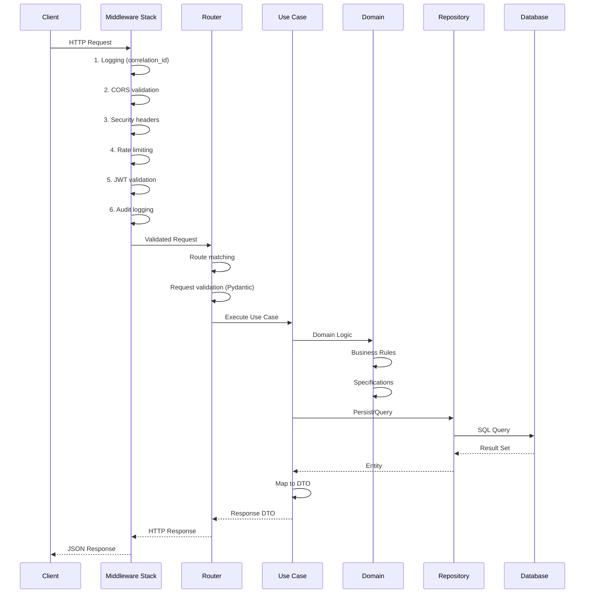
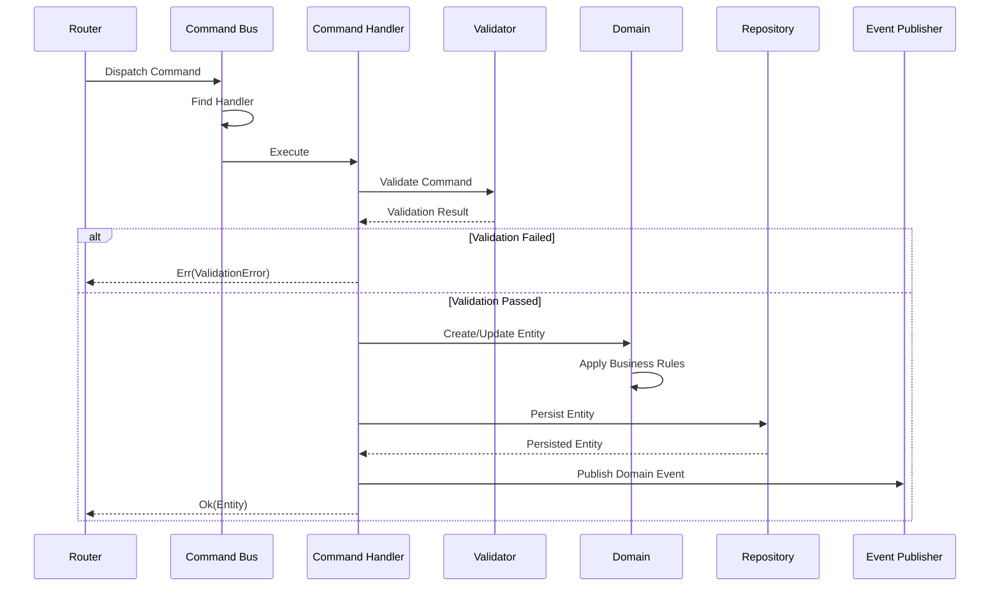
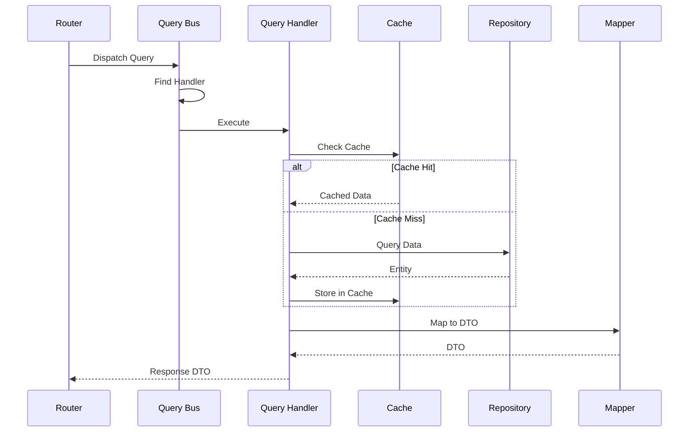
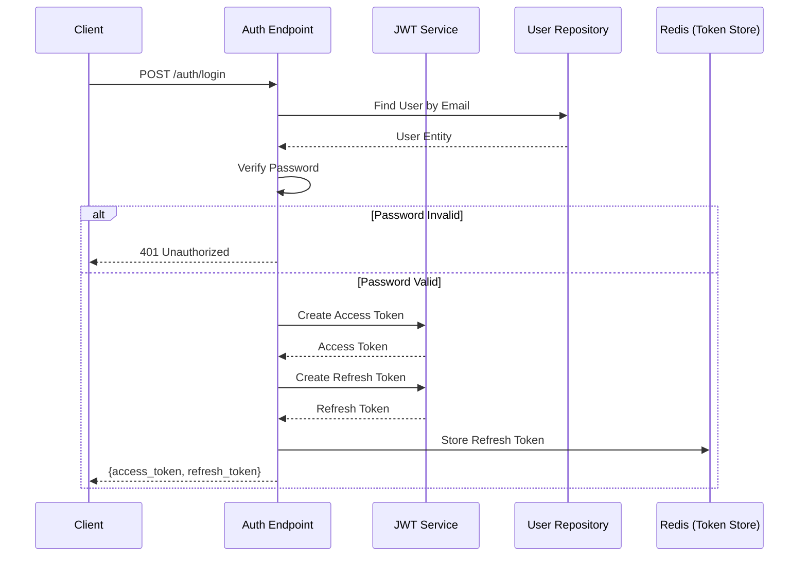
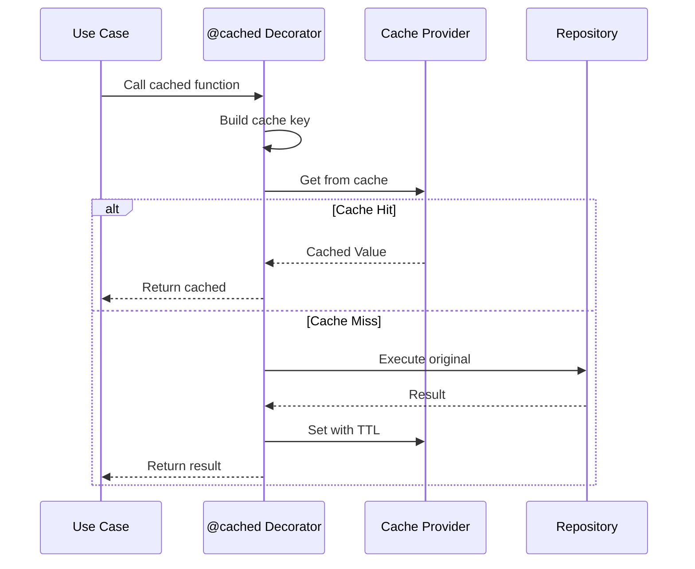
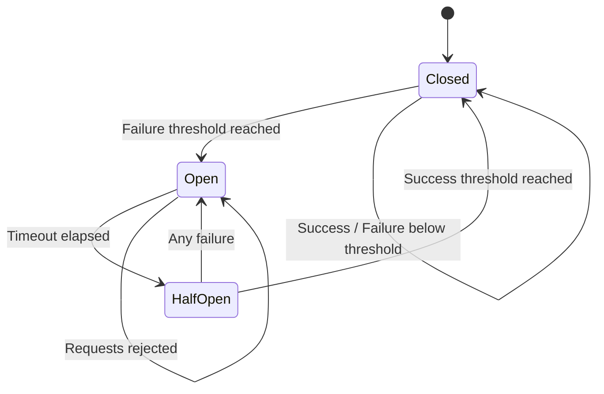
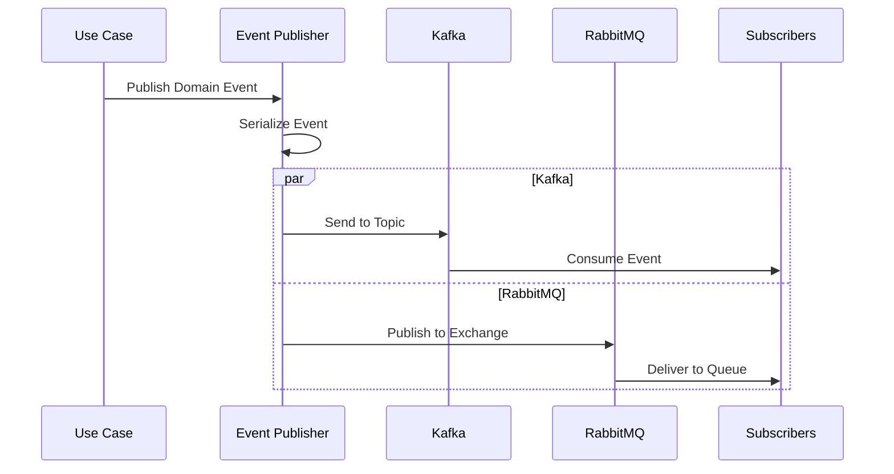
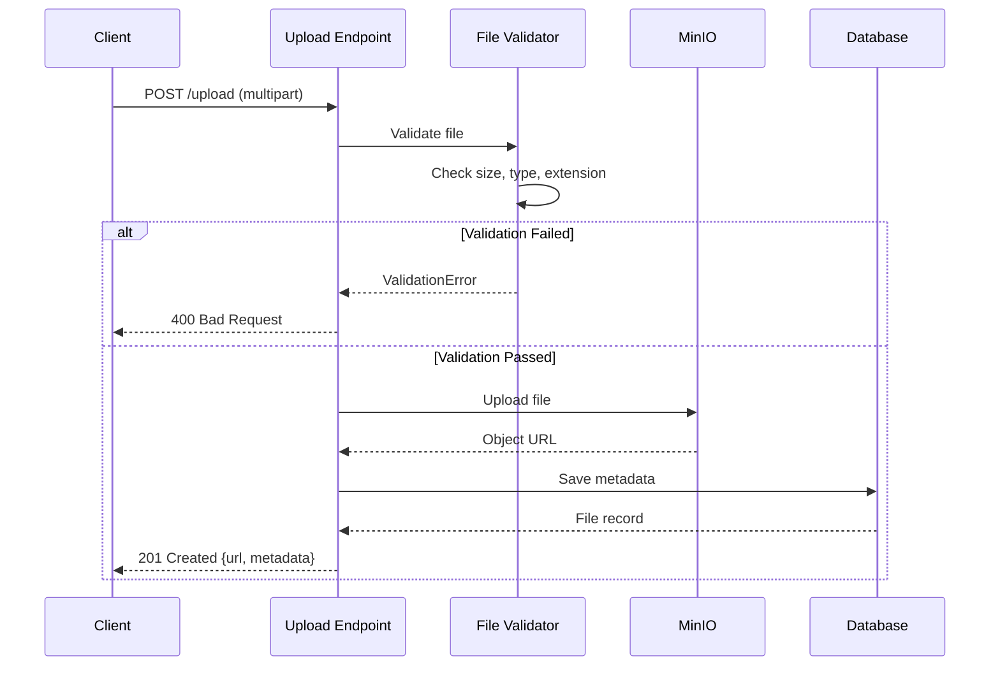

# Data Flow Diagrams

Este documento descreve os fluxos de dados principais do Python API Base.

## HTTP Request Flow

## CQRS Command Flow

## CQRS Query Flow

## Authentication Flow

## Cache Flow

## Resilience Flow (Circuit Breaker)

## Event Publishing Flow

## File Upload Flow

## References

- [Architecture Documentation](../architecture.md)
- [CQRS Pattern](../patterns.md#2-cqrs-pattern)
- [Resilience Patterns](../patterns.md#4-resilience-patterns)
