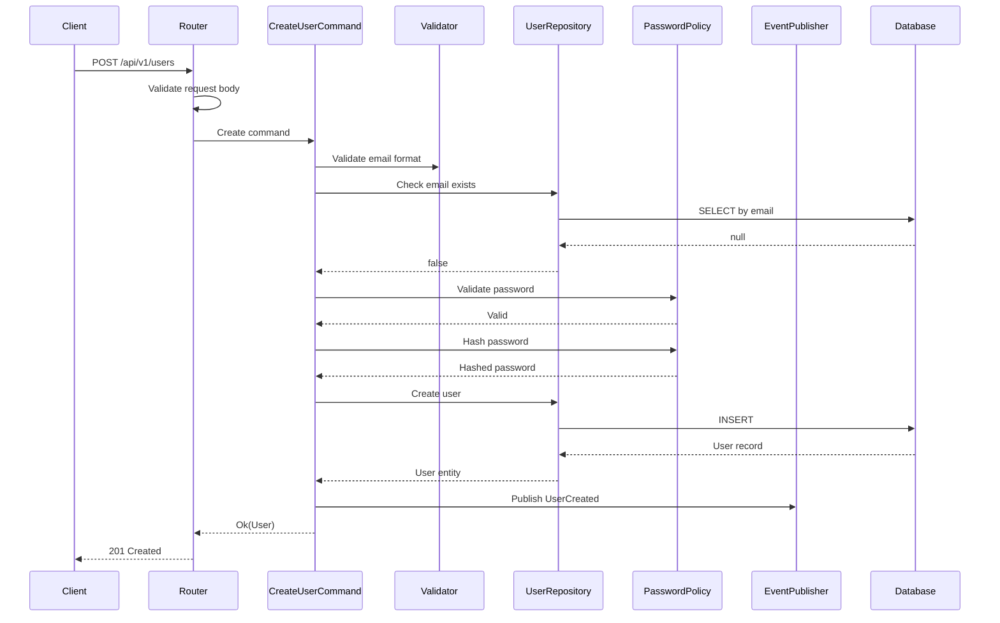
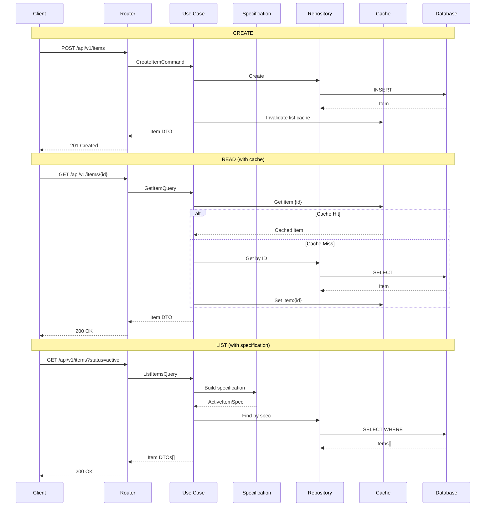
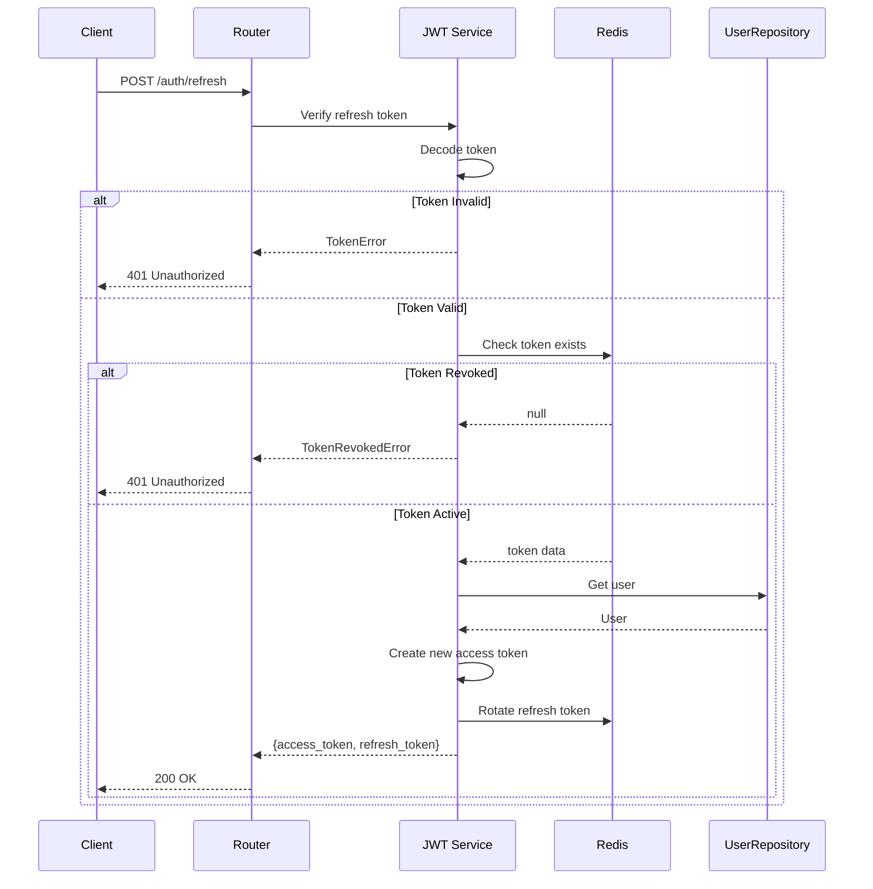
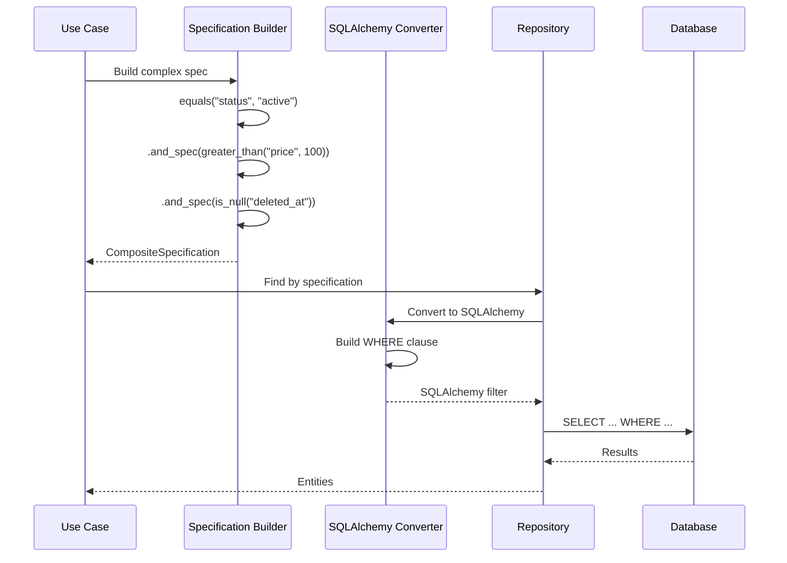
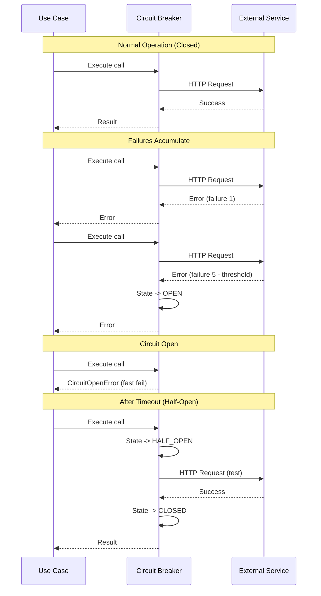
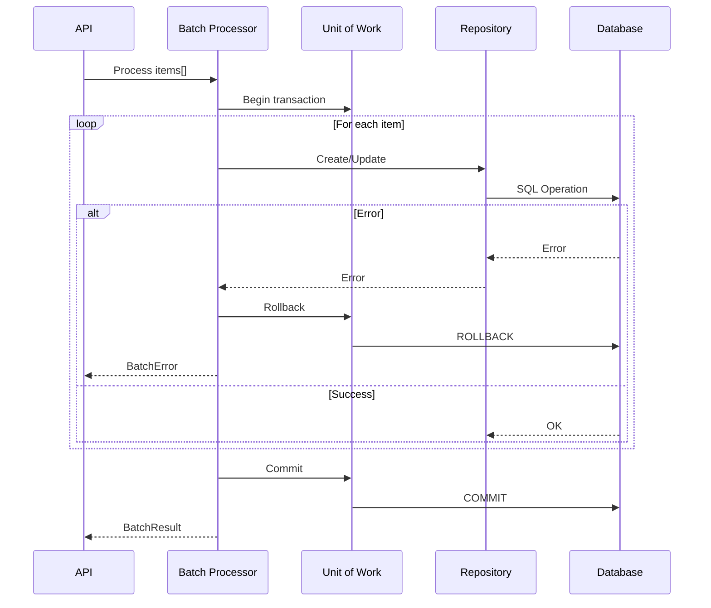
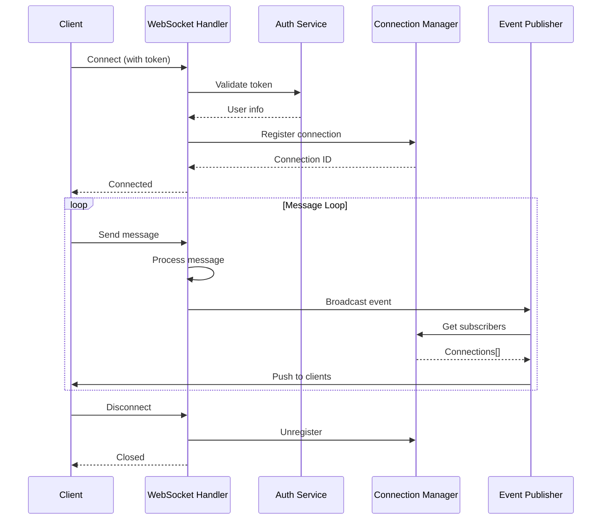

# Sequence Diagrams

Este documento contém diagramas de sequência para os principais fluxos do sistema.

## User Registration

## Item CRUD Operations

## Token Refresh Flow

## Specification Pattern Usage

## Circuit Breaker in Action

## Batch Processing

## WebSocket Connection

## References

- [Architecture Documentation](../architecture.md)
- [Data Flow Diagrams](data-flow.md)
- [C4 Model](architecture-c4.md)
