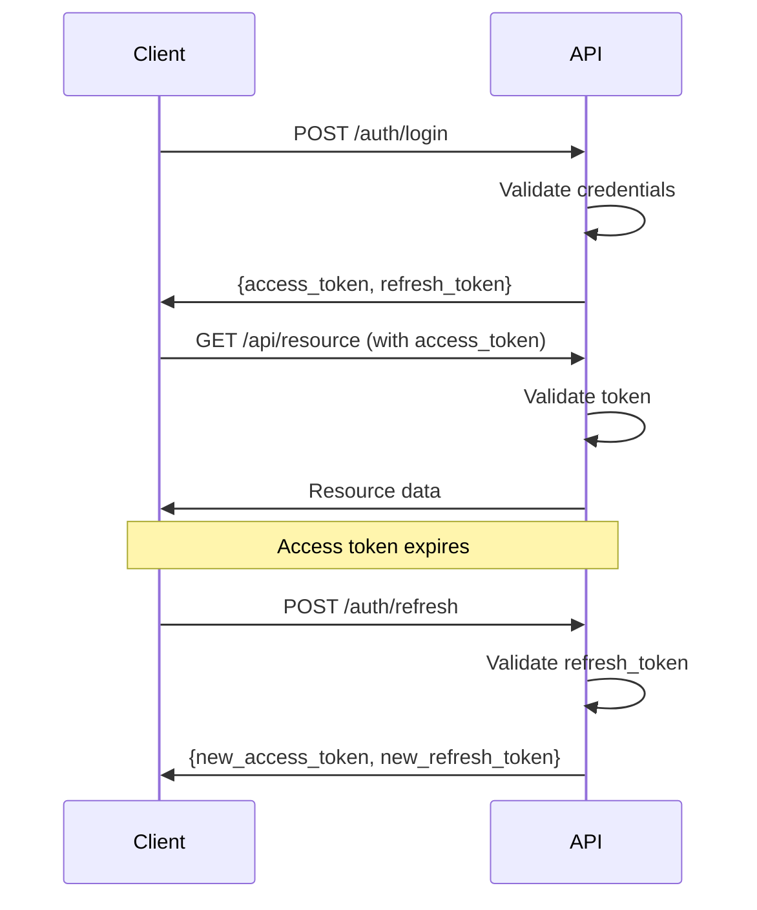

# Security Guide

## Overview

Guia de práticas de segurança para o Python API Base.

## Authentication

### JWT Configuration

```python
class SecuritySettings(BaseSettings):
    secret_key: SecretStr  # Min 32 characters
    algorithm: str = "HS256"
    access_token_expire_minutes: int = 30
    refresh_token_expire_days: int = 7
```

### Token Lifecycle



### Token Revocation

```python
# Store revoked tokens in Redis
async def revoke_token(token_id: str, ttl: int) -> None:
    await redis.set(f"revoked:{token_id}", "1", ex=ttl)

async def is_token_revoked(token_id: str) -> bool:
    return await redis.exists(f"revoked:{token_id}")
```

## Authorization (RBAC)

### Role Hierarchy

```
admin
├── moderator
│   └── user
└── user
```

### Permission Check

```python
class RBACChecker:
    ROLE_PERMISSIONS = {
        "admin": ["*"],
        "moderator": ["users:read", "users:update", "items:*"],
        "user": ["users:read:self", "items:read"],
    }
    
    def has_permission(self, user_roles: list[str], permission: str) -> bool:
        for role in user_roles:
            perms = self.ROLE_PERMISSIONS.get(role, [])
            if "*" in perms or permission in perms:
                return True
            # Check wildcard patterns
            for perm in perms:
                if perm.endswith(":*") and permission.startswith(perm[:-1]):
                    return True
        return False
```

### Usage in Routes

```python
@router.delete("/users/{user_id}")
async def delete_user(
    user_id: str,
    current_user: User = Depends(get_current_user),
    rbac: RBACChecker = Depends(get_rbac),
):
    if not rbac.has_permission(current_user.roles, "users:delete"):
        raise HTTPException(403, "Permission denied")
    # ...
```

## Input Validation

### Pydantic Validation

```python
from pydantic import BaseModel, Field, EmailStr, field_validator

class CreateUserRequest(BaseModel):
    email: EmailStr
    name: str = Field(min_length=2, max_length=100)
    password: str = Field(min_length=8, max_length=128)
    
    @field_validator("name")
    @classmethod
    def sanitize_name(cls, v: str) -> str:
        # Remove potentially dangerous characters
        return re.sub(r'[<>"\']', '', v.strip())
```

### SQL Injection Prevention

```python
# Always use parameterized queries
# GOOD
result = await session.execute(
    select(User).where(User.email == email)
)

# BAD - Never do this
result = await session.execute(
    text(f"SELECT * FROM users WHERE email = '{email}'")
)
```

## Security Headers

```python
class SecurityHeadersMiddleware(BaseHTTPMiddleware):
    async def dispatch(self, request, call_next):
        response = await call_next(request)
        
        response.headers["X-Content-Type-Options"] = "nosniff"
        response.headers["X-Frame-Options"] = "DENY"
        response.headers["X-XSS-Protection"] = "1; mode=block"
        response.headers["Strict-Transport-Security"] = "max-age=31536000; includeSubDomains"
        response.headers["Content-Security-Policy"] = "default-src 'self'"
        response.headers["Referrer-Policy"] = "strict-origin-when-cross-origin"
        
        return response
```

## Rate Limiting

```python
# Per IP rate limiting
RATE_LIMITS = {
    "/auth/login": "5/minute",
    "/auth/register": "3/minute",
    "/api/*": "100/minute",
}
```

## Audit Trail

```python
@dataclass
class AuditRecord:
    action: str
    resource: str
    user_id: str | None
    ip_address: str
    timestamp: datetime
    details: dict

# Log sensitive operations
await audit.log(AuditRecord(
    action="user.delete",
    resource=f"users/{user_id}",
    user_id=current_user.id,
    ip_address=request.client.host,
    timestamp=datetime.utcnow(),
    details={"reason": reason},
))
```

## Secrets Management

```bash
# Never commit secrets
# Use environment variables
SECURITY__SECRET_KEY=your-secret-key

# Or use secrets manager
# AWS Secrets Manager, HashiCorp Vault, etc.
```

## OWASP Top 10 Checklist

| Risk | Mitigation |
|------|------------|
| Injection | Parameterized queries, input validation |
| Broken Auth | JWT with refresh tokens, rate limiting |
| Sensitive Data | HTTPS, encryption at rest |
| XXE | Disable XML external entities |
| Broken Access | RBAC, resource ownership checks |
| Security Misconfig | Security headers, disable debug |
| XSS | Content-Security-Policy, output encoding |
| Insecure Deserialization | Validate input, use safe parsers |
| Vulnerable Components | Regular dependency updates |
| Insufficient Logging | Structured logging, audit trail |

## Best Practices

1. **Never trust user input** - Validate everything
2. **Use HTTPS** - Always in production
3. **Rotate secrets** - Regularly change keys
4. **Log security events** - For audit and detection
5. **Keep dependencies updated** - Regular security patches
