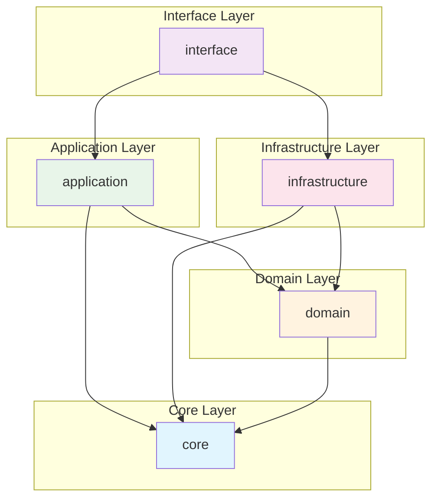

# Camadas do Sistema

## Visão Geral

O Python API Base implementa uma arquitetura em 5 camadas baseada em Clean Architecture. Este documento detalha cada camada, suas responsabilidades e regras de dependência.

## Regra de Dependência

```
Interface → Application → Domain ← Infrastructure
                ↓
              Core
```

**Regra fundamental:** Dependências apontam para dentro. Camadas externas podem depender de camadas internas, mas nunca o contrário.

---

## 1. Core Layer (Kernel)

### Responsabilidades

- Configurações centralizadas
- Definição de protocolos (interfaces)
- Container de injeção de dependência
- Tratamento de erros base
- Tipos e utilitários compartilhados

### Estrutura

```
src/core/
├── __init__.py
├── base/                    # Classes base abstratas
│   ├── __init__.py
│   ├── entity.py           # BaseEntity
│   └── repository.py       # BaseRepository
├── config/                  # Configurações
│   ├── __init__.py
│   ├── settings.py         # Settings principal
│   ├── database.py         # DatabaseSettings
│   ├── security.py         # SecuritySettings
│   ├── observability.py    # ObservabilitySettings
│   └── utils.py            # Utilitários de config
├── di/                      # Dependency Injection
│   ├── __init__.py
│   └── container.py        # DI Container
├── errors/                  # Exception handling
│   ├── __init__.py
│   ├── handlers.py         # FastAPI handlers
│   └── exceptions.py       # Base exceptions
├── protocols/               # Interfaces (Protocol classes)
│   ├── __init__.py
│   ├── base.py             # Identifiable, Timestamped
│   ├── entities.py         # Entity protocols
│   └── repository.py       # Repository protocols
├── shared/                  # Utilitários compartilhados
│   ├── __init__.py
│   ├── logging.py          # Structured logging
│   └── utils.py            # Funções utilitárias
└── types/                   # Type definitions
    ├── __init__.py
    └── common.py           # Type aliases
```

### Componentes Principais

#### Settings (Pydantic)

```python
class Settings(BaseSettings):
    model_config = SettingsConfigDict(
        env_file=".env",
        env_nested_delimiter="__",
    )
    
    app_name: str = "My API"
    debug: bool = False
    version: str = "0.1.0"
    
    database: DatabaseSettings
    security: SecuritySettings
    observability: ObservabilitySettings
```

#### Protocols (Interfaces)

```python
class AsyncRepository[T, ID](Protocol):
    async def get(self, id: ID) -> T | None: ...
    async def create(self, entity: T) -> T: ...
    async def update(self, entity: T) -> T: ...
    async def delete(self, id: ID) -> bool: ...
```

### Dependências

- **Externas:** pydantic, pydantic-settings, structlog
- **Internas:** Nenhuma (camada mais interna)

---

## 2. Domain Layer

### Responsabilidades

- Entidades de negócio
- Value Objects
- Aggregates
- Domain Events
- Specification Pattern
- Interfaces de repositório

### Estrutura

```
src/domain/
├── __init__.py
├── common/                  # Componentes compartilhados
│   ├── __init__.py
│   ├── specification.py    # Specification Pattern
│   ├── value_objects.py    # Value Objects base
│   ├── events.py           # Domain Events base
│   └── aggregates.py       # Aggregate Root base
├── users/                   # Bounded Context: Users
│   ├── __init__.py
│   ├── entities.py         # User entity
│   ├── repository.py       # IUserRepository
│   ├── value_objects.py    # Email, Password, etc.
│   ├── events.py           # UserCreated, UserUpdated
│   └── specifications.py   # User specifications
├── items/                   # Bounded Context: Items
│   ├── __init__.py
│   ├── entities.py
│   ├── repository.py
│   └── events.py
└── examples/                # Bounded Context: Examples
    ├── __init__.py
    ├── entities.py
    └── repository.py
```

### Componentes Principais

#### Specification Pattern

```python
class Specification[T](ABC):
    @abstractmethod
    def is_satisfied_by(self, candidate: T) -> bool: ...
    
    def and_spec(self, other: "Specification[T]") -> "Specification[T]":
        return AndSpecification(self, other)
    
    def or_spec(self, other: "Specification[T]") -> "Specification[T]":
        return OrSpecification(self, other)
    
    def not_spec(self) -> "Specification[T]":
        return NotSpecification(self)
```

#### Entity Base

```python
class Entity[ID](Protocol):
    id: ID

class TrackedEntity[ID](Entity[ID], Protocol):
    created_at: datetime
    updated_at: datetime | None

class VersionedEntity[ID](TrackedEntity[ID], Protocol):
    version: int
```

#### Value Objects

```python
@dataclass(frozen=True, slots=True)
class Email:
    value: str
    
    def __post_init__(self) -> None:
        if not self._is_valid(self.value):
            raise ValueError(f"Invalid email: {self.value}")
```

### Dependências

- **Externas:** Nenhuma (domínio puro)
- **Internas:** core.protocols

---

## 3. Application Layer

### Responsabilidades

- Use Cases (orquestração)
- Commands (operações de escrita)
- Queries (operações de leitura)
- DTOs (Data Transfer Objects)
- Mappers (conversão entre camadas)
- Application Services

### Estrutura

```
src/application/
├── __init__.py
├── common/                  # Infraestrutura compartilhada
│   ├── __init__.py
│   ├── cqrs/               # Command/Query Separation
│   │   ├── __init__.py
│   │   ├── commands.py     # Command base
│   │   ├── queries.py      # Query base
│   │   └── bus.py          # CommandBus, QueryBus
│   ├── middleware/         # Pipeline middleware
│   │   ├── __init__.py
│   │   └── pipeline.py
│   ├── batch/              # Batch operations
│   │   └── __init__.py
│   ├── dtos.py             # DTOs base
│   ├── mappers.py          # Mapper base
│   └── exceptions.py       # Application exceptions
├── services/                # Cross-cutting services
│   ├── __init__.py
│   ├── feature_flags/      # Feature toggles
│   │   └── service.py
│   ├── file_upload/        # Upload handling
│   │   └── service.py
│   └── multitenancy/       # Tenant isolation
│       └── service.py
├── users/                   # Users bounded context
│   ├── __init__.py
│   ├── commands/           # Write operations
│   │   ├── __init__.py
│   │   ├── create_user.py
│   │   ├── update_user.py
│   │   └── delete_user.py
│   ├── queries/            # Read operations
│   │   ├── __init__.py
│   │   ├── get_user.py
│   │   └── list_users.py
│   ├── dtos.py             # UserDTO, CreateUserDTO
│   ├── mappers.py          # UserMapper
│   └── projections.py      # Event handlers
├── items/                   # Items bounded context
│   ├── __init__.py
│   ├── commands/
│   ├── queries/
│   ├── dtos.py
│   └── mappers.py
└── examples/                # Examples bounded context
    └── ...
```

### Componentes Principais

#### CQRS - Commands

```python
@dataclass
class CreateUserCommand(Command[User]):
    email: str
    name: str
    password: str
    
    async def execute(self, repository: IUserRepository) -> Result[User, str]:
        # Validação
        if await repository.exists_by_email(self.email):
            return Err("Email already exists")
        
        # Criação
        user = User(
            id=generate_ulid(),
            email=self.email,
            name=self.name,
            password_hash=hash_password(self.password),
        )
        
        return Ok(await repository.create(user))
```

#### CQRS - Queries

```python
@dataclass
class GetUserQuery(Query[UserDTO]):
    user_id: str
    cacheable: bool = True
    cache_ttl: int = 300
    
    async def execute(self, repository: IUserRepository) -> UserDTO | None:
        user = await repository.get(self.user_id)
        if user is None:
            return None
        return UserMapper.to_dto(user)
```

#### DTOs

```python
class UserDTO(BaseModel):
    id: str
    email: str
    name: str
    created_at: datetime
    
    model_config = ConfigDict(from_attributes=True)

class CreateUserDTO(BaseModel):
    email: EmailStr
    name: str = Field(min_length=2, max_length=100)
    password: str = Field(min_length=8)
```

### Dependências

- **Externas:** pydantic
- **Internas:** domain.*, core.protocols

---

## 4. Infrastructure Layer

### Responsabilidades

- Implementações de repositórios
- Acesso a banco de dados
- Cache (Redis, Memory)
- Messaging (Kafka, RabbitMQ)
- Storage (MinIO, S3)
- Autenticação (JWT)
- Observabilidade (Telemetry)
- Resiliência (Circuit Breaker, Retry)

### Estrutura

```
src/infrastructure/
├── __init__.py
├── exceptions.py            # Infrastructure exceptions
├── audit/                   # Audit trail
│   ├── __init__.py
│   ├── models.py           # AuditRecord
│   └── store.py            # AuditStore
├── auth/                    # Authentication
│   ├── __init__.py
│   ├── jwt.py              # JWT service
│   ├── password_policy.py  # Password validation
│   └── token_store.py      # Token storage
├── cache/                   # Caching
│   ├── __init__.py
│   ├── protocols.py        # CacheProvider protocol
│   ├── models.py           # CacheEntry, CacheStats
│   ├── memory_provider.py  # In-memory cache
│   ├── redis_provider.py   # Redis cache
│   └── decorators.py       # @cached decorator
├── db/                      # Database
│   ├── __init__.py
│   ├── session.py          # AsyncSession
│   ├── repository.py       # SQLAlchemy repository
│   └── query_builder/      # Query construction
├── elasticsearch/           # Search
│   ├── __init__.py
│   ├── repository.py
│   └── query.py
├── kafka/                   # Event streaming
│   ├── __init__.py
│   ├── producer.py
│   ├── consumer.py
│   └── transaction.py
├── minio/                   # Object storage
│   ├── __init__.py
│   ├── client.py
│   ├── upload_operations.py
│   └── download_operations.py
├── observability/           # Telemetry
│   ├── __init__.py
│   ├── middleware.py
│   └── telemetry/
│       └── service.py
├── rbac/                    # Authorization
│   ├── __init__.py
│   └── checker.py
├── redis/                   # Redis client
│   ├── __init__.py
│   └── client.py
├── resilience/              # Fault tolerance
│   ├── __init__.py
│   └── patterns.py         # CircuitBreaker, Retry
├── storage/                 # File storage
│   ├── __init__.py
│   └── handlers.py
├── tasks/                   # Background jobs
│   ├── __init__.py
│   ├── rabbitmq_config.py
│   ├── rabbitmq_queue.py
│   ├── rabbitmq_worker.py
│   └── rabbitmq_rpc.py
├── multitenancy/            # Multi-tenant
│   ├── __init__.py
│   └── context.py
├── feature_flags/           # Feature toggles
│   ├── __init__.py
│   ├── models.py
│   └── evaluator.py
└── ...
```

### Componentes Principais

#### Repository Implementation

```python
class SQLAlchemyRepository[T: SQLModel, ID](AsyncRepository[T, ID]):
    def __init__(self, session: AsyncSession, model: type[T]):
        self._session = session
        self._model = model
    
    async def get(self, id: ID) -> T | None:
        return await self._session.get(self._model, id)
    
    async def create(self, entity: T) -> T:
        self._session.add(entity)
        await self._session.flush()
        await self._session.refresh(entity)
        return entity
```

#### Cache Provider

```python
class RedisCacheProvider[T](CacheProvider[T]):
    def __init__(self, client: RedisClient, serializer: Serializer[T]):
        self._client = client
        self._serializer = serializer
    
    async def get(self, key: str) -> T | None:
        data = await self._client.get(key)
        if data is None:
            return None
        return self._serializer.deserialize(data)
    
    async def set(self, key: str, value: T, ttl: int | None = None) -> None:
        data = self._serializer.serialize(value)
        await self._client.set(key, data, ex=ttl)
```

#### Resilience Patterns

```python
class CircuitBreaker[TConfig]:
    def __init__(self, config: CircuitBreakerConfig):
        self._config = config
        self._state = CircuitState.CLOSED
        self._failure_count = 0
    
    async def execute[T](self, func: Callable[[], Awaitable[T]]) -> T:
        if self._state == CircuitState.OPEN:
            raise CircuitOpenError()
        
        try:
            result = await func()
            self._on_success()
            return result
        except Exception as e:
            self._on_failure()
            raise
```

### Dependências

- **Externas:** sqlalchemy, redis, minio, aiokafka, elasticsearch
- **Internas:** domain.*, core.*

---

## 5. Interface Layer

### Responsabilidades

- Rotas HTTP (REST API)
- GraphQL schema
- WebSocket handlers
- Middleware HTTP
- Validação de entrada
- Serialização de resposta
- Versionamento de API
- Documentação OpenAPI

### Estrutura

```
src/interface/
├── __init__.py
├── dependencies.py          # FastAPI dependencies
├── openapi.py              # OpenAPI customization
├── router.py               # Main router
├── versioning.py           # Version utilities
├── errors/                  # Error handlers
│   ├── __init__.py
│   └── handlers.py         # RFC 7807 handlers
├── graphql/                 # GraphQL
│   ├── __init__.py
│   └── schema.py           # Strawberry schema
├── middleware/              # HTTP middleware
│   ├── __init__.py
│   ├── production.py       # Production stack
│   └── security_headers.py # Security headers
├── routes/                  # Route definitions
│   └── __init__.py
├── v1/                      # API v1
│   ├── __init__.py
│   ├── auth.py             # Auth endpoints
│   ├── users.py            # User endpoints
│   ├── items.py            # Item endpoints
│   ├── examples.py         # Example endpoints
│   ├── health_router.py    # Health checks
│   ├── infrastructure_router.py
│   └── enterprise/         # Enterprise features
│       ├── __init__.py
│       ├── rbac.py
│       ├── docs.py
│       └── dependencies.py
├── v2/                      # API v2
│   └── __init__.py
├── versioning/              # Version strategies
│   ├── __init__.py
│   └── strategies.py
└── websocket/               # WebSocket
    ├── __init__.py
    └── handlers.py
```

### Componentes Principais

#### Router Definition

```python
router = APIRouter(prefix="/users", tags=["Users"])

@router.post("/", response_model=UserResponse, status_code=201)
async def create_user(
    data: CreateUserRequest,
    use_case: CreateUserUseCase = Depends(get_create_user_use_case),
) -> UserResponse:
    result = await use_case.execute(data)
    if result.is_err():
        raise HTTPException(400, detail=result.error)
    return UserResponse.from_entity(result.value)
```

#### Middleware Stack

```python
def setup_production_middleware(app: FastAPI) -> None:
    # 1. Logging (correlation ID)
    app.add_middleware(LoggingMiddleware)
    
    # 2. CORS
    app.add_middleware(CORSMiddleware, ...)
    
    # 3. Security headers
    app.add_middleware(SecurityHeadersMiddleware, ...)
    
    # 4. Rate limiting
    app.add_middleware(RateLimitMiddleware, ...)
    
    # 5. Audit
    app.add_middleware(AuditMiddleware, ...)
```

#### Health Checks

```python
@router.get("/health/live")
async def liveness() -> dict:
    return {"status": "healthy"}

@router.get("/health/ready")
async def readiness(
    db: AsyncSession = Depends(get_session),
    redis: RedisClient = Depends(get_redis),
) -> dict:
    checks = {
        "database": await check_database(db),
        "redis": await check_redis(redis),
    }
    status = "healthy" if all(c == "healthy" for c in checks.values()) else "unhealthy"
    return {"status": status, "checks": checks}
```

### Dependências

- **Externas:** fastapi, strawberry-graphql
- **Internas:** application.*, infrastructure.auth, infrastructure.observability

---

## 6. Diagrama de Dependências



---

## 7. Regras de Importação

### Permitido ✅

```python
# Interface pode importar de Application
from application.users.dtos import UserDTO

# Application pode importar de Domain
from domain.users.entities import User

# Infrastructure pode importar de Domain
from domain.users.repository import IUserRepository

# Todos podem importar de Core
from core.protocols import AsyncRepository
```

### Proibido ❌

```python
# Domain NÃO pode importar de Application
from application.users.dtos import UserDTO  # ❌

# Domain NÃO pode importar de Infrastructure
from infrastructure.db.session import get_session  # ❌

# Application NÃO pode importar de Interface
from interface.v1.users import router  # ❌
```
