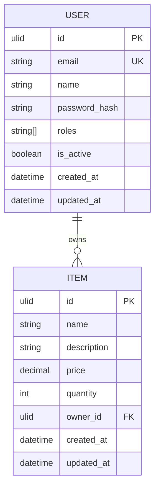

# Bounded Contexts

## Overview

Each bounded context represents a distinct subdomain with its own ubiquitous language, entities, and rules.

## Users Context

### Location

```
src/domain/users/
├── __init__.py
├── aggregates.py    # User aggregate
├── events.py        # User domain events
├── repositories.py  # Repository interface
├── services.py      # Domain services
└── value_objects.py # User value objects
```

### User Aggregate

```python
class User(AggregateRoot[ULID]):
    """User aggregate root."""
    
    id: ULID
    email: Email
    name: str
    password_hash: str
    roles: list[str]
    is_active: bool
    created_at: datetime
    updated_at: datetime | None
    
    def activate(self) -> None:
        """Activate user account."""
        if self.is_active:
            raise BusinessRuleError("User already active")
        self.is_active = True
        self.add_domain_event(UserActivatedEvent(user_id=self.id))
    
    def deactivate(self) -> None:
        """Deactivate user account."""
        self.is_active = False
        self.add_domain_event(UserDeactivatedEvent(user_id=self.id))
    
    def change_email(self, new_email: Email) -> None:
        """Change user email."""
        old_email = self.email
        self.email = new_email
        self.add_domain_event(
            UserEmailChangedEvent(
                user_id=self.id,
                old_email=old_email,
                new_email=new_email,
            )
        )
```

### User Value Objects

```python
@dataclass(frozen=True)
class Email:
    """Email value object."""
    
    value: str
    
    def __post_init__(self):
        if not self._is_valid(self.value):
            raise ValidationError("Invalid email format")
    
    @staticmethod
    def _is_valid(email: str) -> bool:
        pattern = r"^[\w\.-]+@[\w\.-]+\.\w+$"
        return bool(re.match(pattern, email))

@dataclass(frozen=True)
class Password:
    """Password value object (hashed)."""
    
    hash: str
    
    @classmethod
    def create(cls, plain_password: str, hasher: PasswordHasher) -> "Password":
        return cls(hash=hasher.hash(plain_password))
    
    def verify(self, plain_password: str, hasher: PasswordHasher) -> bool:
        return hasher.verify(plain_password, self.hash)
```

### User Events

```python
@dataclass
class UserCreatedEvent(DomainEvent):
    user_id: ULID
    email: str

@dataclass
class UserActivatedEvent(DomainEvent):
    user_id: ULID

@dataclass
class UserEmailChangedEvent(DomainEvent):
    user_id: ULID
    old_email: str
    new_email: str
```

## Items Context

### Location

```
src/domain/items/
├── __init__.py
├── entities.py      # Item entity
└── value_objects.py # Item value objects
```

### Item Entity

```python
class Item(Entity[ULID]):
    """Item entity."""
    
    id: ULID
    name: str
    description: str | None
    price: Money
    quantity: int
    owner_id: ULID
    created_at: datetime
    updated_at: datetime | None
    
    def update_price(self, new_price: Money) -> None:
        """Update item price."""
        if new_price.amount <= 0:
            raise ValidationError("Price must be positive")
        self.price = new_price
    
    def adjust_quantity(self, delta: int) -> None:
        """Adjust item quantity."""
        new_quantity = self.quantity + delta
        if new_quantity < 0:
            raise BusinessRuleError("Quantity cannot be negative")
        self.quantity = new_quantity
```

### Item Value Objects

```python
@dataclass(frozen=True)
class Money:
    """Money value object."""
    
    amount: Decimal
    currency: str = "USD"
    
    def __post_init__(self):
        if self.amount < 0:
            raise ValidationError("Amount cannot be negative")
    
    def add(self, other: "Money") -> "Money":
        if self.currency != other.currency:
            raise BusinessRuleError("Cannot add different currencies")
        return Money(self.amount + other.amount, self.currency)
    
    def multiply(self, factor: Decimal) -> "Money":
        return Money(self.amount * factor, self.currency)
```

## Examples Context

### Location

```
src/domain/examples/
├── __init__.py
├── item/           # Example item
│   ├── entities.py
│   └── specifications.py
└── pedido/         # Example order (pedido)
    ├── entities.py
    └── specifications.py
```

### Example Specifications

```python
# Item specifications
class ActiveItemSpecification(Specification[Item]):
    def is_satisfied_by(self, item: Item) -> bool:
        return item.is_active

class PriceRangeSpecification(Specification[Item]):
    def __init__(self, min_price: Money, max_price: Money):
        self.min_price = min_price
        self.max_price = max_price
    
    def is_satisfied_by(self, item: Item) -> bool:
        return self.min_price.amount <= item.price.amount <= self.max_price.amount

# Composition
affordable_active = (
    ActiveItemSpecification()
    .and_spec(PriceRangeSpecification(Money(0), Money(100)))
)
```

## Entity Diagram



## Related Documentation

- [Specifications](specifications.md)
- [Events](events.md)
- [Repositories](repositories.md)
