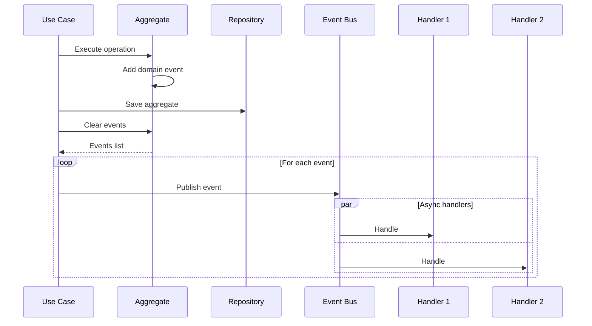

# Domain Events

## Overview

Domain events represent something that happened in the domain that domain experts care about. They enable loose coupling between aggregates and support eventual consistency.

## Location

```
src/core/base/events/
├── __init__.py
├── base.py         # Base event classes
├── bus.py          # Event bus
└── handlers.py     # Handler base
```

## Base Domain Event

```python
from dataclasses import dataclass, field
from datetime import datetime
from uuid import uuid4

@dataclass
class DomainEvent:
    """Base class for all domain events."""
    
    event_id: str = field(default_factory=lambda: str(uuid4()))
    occurred_at: datetime = field(default_factory=datetime.utcnow)
    aggregate_id: str | None = None
    aggregate_type: str | None = None
    
    @property
    def event_type(self) -> str:
        """Return the event type name."""
        return self.__class__.__name__
```

## Event Types

### User Events

```python
@dataclass
class UserCreatedEvent(DomainEvent):
    """Raised when a new user is created."""
    user_id: str
    email: str
    aggregate_type: str = "User"

@dataclass
class UserActivatedEvent(DomainEvent):
    """Raised when a user is activated."""
    user_id: str
    aggregate_type: str = "User"

@dataclass
class UserDeactivatedEvent(DomainEvent):
    """Raised when a user is deactivated."""
    user_id: str
    aggregate_type: str = "User"

@dataclass
class UserEmailChangedEvent(DomainEvent):
    """Raised when user email changes."""
    user_id: str
    old_email: str
    new_email: str
    aggregate_type: str = "User"

@dataclass
class UserPasswordChangedEvent(DomainEvent):
    """Raised when user password changes."""
    user_id: str
    aggregate_type: str = "User"
```

### Item Events

```python
@dataclass
class ItemCreatedEvent(DomainEvent):
    """Raised when an item is created."""
    item_id: str
    owner_id: str
    aggregate_type: str = "Item"

@dataclass
class ItemPriceChangedEvent(DomainEvent):
    """Raised when item price changes."""
    item_id: str
    old_price: Decimal
    new_price: Decimal
    aggregate_type: str = "Item"

@dataclass
class ItemQuantityAdjustedEvent(DomainEvent):
    """Raised when item quantity is adjusted."""
    item_id: str
    delta: int
    new_quantity: int
    aggregate_type: str = "Item"
```

## Event Bus

### Interface

```python
class IEventBus(Protocol):
    """Event bus interface."""
    
    async def publish(self, event: DomainEvent) -> None:
        """Publish a domain event."""
        ...
    
    def subscribe(
        self,
        event_type: type[TEvent],
        handler: "EventHandler[TEvent]",
    ) -> None:
        """Subscribe a handler to an event type."""
        ...
    
    def unsubscribe(
        self,
        event_type: type[TEvent],
        handler: "EventHandler[TEvent]",
    ) -> None:
        """Unsubscribe a handler from an event type."""
        ...
```

### Implementation

```python
class InMemoryEventBus:
    """In-memory event bus implementation."""
    
    def __init__(self):
        self._handlers: dict[type, list[EventHandler]] = {}
    
    async def publish(self, event: DomainEvent) -> None:
        """Publish event to all subscribed handlers."""
        event_type = type(event)
        handlers = self._handlers.get(event_type, [])
        
        for handler in handlers:
            try:
                await handler.handle(event)
            except Exception as e:
                logger.error(
                    "Event handler failed",
                    event_type=event_type.__name__,
                    handler=handler.__class__.__name__,
                    error=str(e),
                )
    
    def subscribe(
        self,
        event_type: type[TEvent],
        handler: EventHandler[TEvent],
    ) -> None:
        """Subscribe handler to event type."""
        if event_type not in self._handlers:
            self._handlers[event_type] = []
        self._handlers[event_type].append(handler)
```

## Event Handlers

### Base Handler

```python
from abc import ABC, abstractmethod

class EventHandler(ABC, Generic[TEvent]):
    """Base class for event handlers."""
    
    @abstractmethod
    async def handle(self, event: TEvent) -> None:
        """Handle the event."""
        ...
```

### Example Handlers

```python
class SendWelcomeEmailHandler(EventHandler[UserCreatedEvent]):
    """Send welcome email when user is created."""
    
    def __init__(self, email_service: IEmailService):
        self._email_service = email_service
    
    async def handle(self, event: UserCreatedEvent) -> None:
        await self._email_service.send_welcome_email(
            email=event.email,
            user_id=event.user_id,
        )

class UpdateSearchIndexHandler(EventHandler[ItemCreatedEvent]):
    """Update search index when item is created."""
    
    def __init__(self, search_service: ISearchService):
        self._search_service = search_service
    
    async def handle(self, event: ItemCreatedEvent) -> None:
        await self._search_service.index_item(event.item_id)
```

## Publishing Events

### From Aggregate

```python
class User(AggregateRoot[ULID]):
    def activate(self) -> None:
        self.is_active = True
        self.add_domain_event(UserActivatedEvent(user_id=str(self.id)))
```

### From Use Case

```python
class CreateUserUseCase:
    def __init__(
        self,
        repository: IUserRepository,
        event_bus: IEventBus,
    ):
        self._repository = repository
        self._event_bus = event_bus
    
    async def execute(self, command: CreateUserCommand) -> User:
        user = User.create(command.email, command.name)
        await self._repository.add(user)
        
        # Publish collected events
        for event in user.clear_domain_events():
            await self._event_bus.publish(event)
        
        return user
```

## Event Flow



## Related Documentation

- [Bounded Contexts](bounded-contexts.md)
- [CQRS](../application/cqrs.md)
- [Infrastructure Layer](../infrastructure/index.md)
