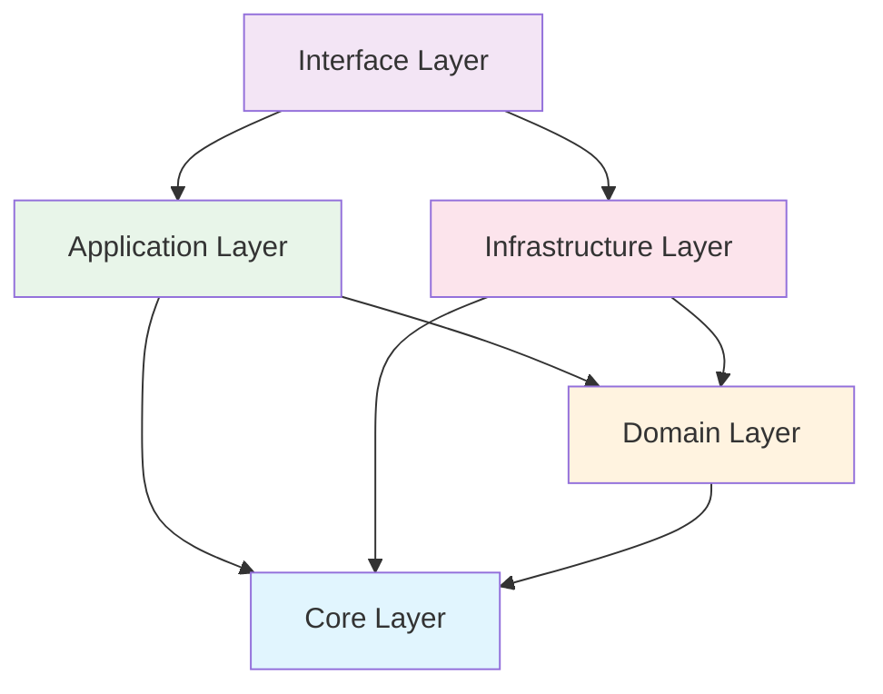

# Architecture Layers

## Overview

O Python API Base implementa uma arquitetura em 5 camadas baseada em Clean Architecture.

## Layer Diagram



## Dependency Rule

**Dependências apontam para dentro.** Camadas externas podem depender de camadas internas, mas nunca o contrário.

## Layers

| Layer | Responsibility | Documentation |
|-------|----------------|---------------|
| **Core** | Configuration, Protocols, DI | [core/](core/index.md) |
| **Domain** | Entities, Value Objects, Specifications | [domain/](domain/index.md) |
| **Application** | Use Cases, CQRS, DTOs | [application/](application/index.md) |
| **Infrastructure** | Database, Cache, Messaging | [infrastructure/](infrastructure/index.md) |
| **Interface** | REST API, GraphQL, WebSocket | [interface/](interface/index.md) |

## Import Rules

### Allowed ✅

```python
# Interface → Application
from application.users.dtos import UserDTO

# Application → Domain
from domain.users.entities import User

# Infrastructure → Domain
from domain.users.repository import IUserRepository

# All → Core
from core.protocols import AsyncRepository
```

### Prohibited ❌

```python
# Domain → Application
from application.users.dtos import UserDTO  # ❌

# Domain → Infrastructure
from infrastructure.db.session import get_session  # ❌

# Application → Interface
from interface.v1.users import router  # ❌
```

## Quick Reference

| From Layer | Can Import From |
|------------|-----------------|
| Interface | Application, Infrastructure (auth), Core |
| Application | Domain, Core |
| Infrastructure | Domain, Core |
| Domain | Core |
| Core | (none) |
