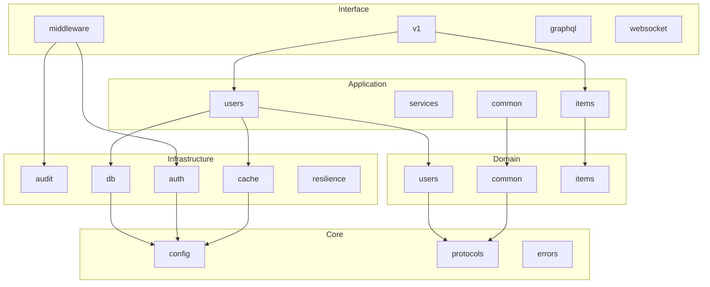

# Módulos do Sistema

## Visão Geral

Este documento descreve todos os módulos do Python API Base, suas responsabilidades e dependências.

## 1. Core Modules

### 1.1 `core.config`

**Propósito:** Gerenciamento centralizado de configurações.

```
core/config/
├── __init__.py
├── settings.py      # Settings principal agregador
├── database.py      # DatabaseSettings
├── security.py      # SecuritySettings, RedisSettings
├── observability.py # ObservabilitySettings
└── utils.py         # Utilitários (redact_url_credentials)
```

**Dependências:**
- `pydantic-settings` - Validação de configurações
- `pydantic` - Modelos de dados

**Exports:**
```python
from core.config import (
    Settings,
    get_settings,
    DatabaseSettings,
    SecuritySettings,
    ObservabilitySettings,
    RedisSettings,
)
```

### 1.2 `core.protocols`

**Propósito:** Definição de interfaces (Protocol classes).

```
core/protocols/
├── __init__.py
├── base.py          # Identifiable, Timestamped, SoftDeletable
├── entities.py      # Entity, TrackedEntity, VersionedEntity
└── repository.py    # AsyncRepository, UnitOfWork, Mapper
```

**Exports:**
```python
from core.protocols import (
    # Base
    Identifiable, Timestamped, SoftDeletable,
    # Entities
    Entity, TrackedEntity, VersionedEntity, FullEntity,
    Auditable, Versionable, DeletableEntity,
    # Repository
    AsyncRepository, UnitOfWork, Mapper,
    CacheProvider, Command, Query,
    CommandHandler, QueryHandler, EventHandler,
)
```

### 1.3 `core.errors`

**Propósito:** Tratamento de erros RFC 7807.

```
core/errors/
├── __init__.py
├── handlers.py      # Exception handlers FastAPI
└── exceptions.py    # Exceções de domínio
```

**Funcionalidades:**
- Problem Details (RFC 7807)
- Mapeamento de exceções para HTTP status
- Logging automático de erros

### 1.4 `core.shared`

**Propósito:** Utilitários compartilhados.

```
core/shared/
├── __init__.py
├── logging.py       # Structured logging (structlog)
└── utils.py         # Funções utilitárias
```

**Logging Features:**
- JSON output format
- ECS-compatible fields
- PII redaction
- Correlation ID support

### 1.5 `core.di`

**Propósito:** Container de Injeção de Dependência.

```
core/di/
├── __init__.py
└── container.py     # DI Container (dependency-injector)
```

### 1.6 `core.types`

**Propósito:** Type aliases e definições de tipos.

```
core/types/
├── __init__.py
└── common.py        # Type aliases comuns
```

---

## 2. Domain Modules

### 2.1 `domain.common`

**Propósito:** Componentes de domínio compartilhados.

```
domain/common/
├── __init__.py
├── specification.py # Specification Pattern
├── value_objects.py # Value Objects base
└── events.py        # Domain Events
```

**Specification Classes:**
```python
Specification[T]              # Base abstrata
AndSpecification[T]           # AND lógico
OrSpecification[T]            # OR lógico
NotSpecification[T]           # Negação
PredicateSpecification[T]     # Baseada em função
AttributeSpecification[T, V]  # Baseada em atributo
```

**Factory Functions:**
```python
spec(predicate, name)         # Cria specification de função
equals(attribute, value)      # Igualdade
not_equals(attribute, value)  # Diferença
greater_than(attribute, value)
less_than(attribute, value)
contains(attribute, value)
is_null(attribute)
is_not_null(attribute)
```

### 2.2 `domain.users`

**Propósito:** Bounded Context de Usuários.

```
domain/users/
├── __init__.py
├── entities.py      # User entity
├── repository.py    # IUserRepository
├── value_objects.py # Email, Password, etc.
└── events.py        # UserCreated, UserUpdated, etc.
```

### 2.3 `domain.items`

**Propósito:** Bounded Context de Items.

```
domain/items/
├── __init__.py
├── entities.py      # Item entity
├── repository.py    # IItemRepository
└── events.py        # ItemCreated, etc.
```

### 2.4 `domain.examples`

**Propósito:** Exemplos de implementação (remover em produção).

```
domain/examples/
├── __init__.py
├── entities.py
└── repository.py
```

---

## 3. Application Modules

### 3.1 `application.common`

**Propósito:** Infraestrutura compartilhada da camada de aplicação.

```
application/common/
├── __init__.py
├── cqrs/            # Command/Query Separation
│   ├── commands.py  # Command base
│   ├── queries.py   # Query base
│   └── bus.py       # CommandBus, QueryBus
├── middleware/      # Pipeline middleware
├── batch/           # Batch operations
├── dtos.py          # DTOs base
├── mappers.py       # Mapper base
└── exceptions.py    # Application exceptions
```

**CQRS Components:**
```python
# Commands
Command[TResult]              # Base command
CommandHandler[TCommand, TResult]  # Handler

# Queries
Query[TResult]                # Base query
QueryHandler[TQuery, TResult] # Handler

# Buses
CommandBus                    # Dispatch commands
QueryBus                      # Dispatch queries
```

### 3.2 `application.services`

**Propósito:** Serviços cross-cutting.

```
application/services/
├── __init__.py
├── feature_flags/   # Feature toggles
│   └── service.py
├── file_upload/     # Upload handling
│   └── service.py
└── multitenancy/    # Tenant isolation
    └── service.py
```

### 3.3 `application.users`

**Propósito:** Use cases de usuários.

```
application/users/
├── __init__.py
├── commands/        # Write operations
│   ├── create_user.py
│   ├── update_user.py
│   └── delete_user.py
├── queries/         # Read operations
│   ├── get_user.py
│   └── list_users.py
├── dtos.py          # UserDTO, CreateUserDTO
├── mappers.py       # UserMapper
└── projections.py   # Event handlers
```

### 3.4 `application.items`

**Propósito:** Use cases de items.

```
application/items/
├── __init__.py
├── commands/
├── queries/
├── dtos.py
└── mappers.py
```

---

## 4. Infrastructure Modules

### 4.1 `infrastructure.audit`

**Propósito:** Sistema de auditoria.

```
infrastructure/audit/
├── __init__.py
├── models.py        # AuditRecord[T], AuditAction
├── store.py         # AuditStore[TProvider]
└── in_memory.py     # InMemoryAuditStore
```

**Exports:**
```python
from infrastructure.audit import (
    AuditAction,
    AuditQuery,
    AuditRecord,
    AuditStore,
    InMemoryAuditStore,
)
```

### 4.2 `infrastructure.auth`

**Propósito:** Autenticação e autorização.

```
infrastructure/auth/
├── __init__.py
├── jwt.py           # JWT service
├── password_policy.py # Password validation
└── token_store.py   # Token storage (Redis)
```

### 4.3 `infrastructure.cache`

**Propósito:** Sistema de cache.

```
infrastructure/cache/
├── __init__.py
├── protocols.py     # CacheProvider[T], Serializer[T]
├── models.py        # CacheKey[T], CacheEntry[T], CacheStats
├── memory_provider.py # MemoryCacheProvider
├── redis_provider.py  # RedisCacheProvider
└── decorators.py    # @cached decorator
```

**Exports:**
```python
from infrastructure.cache import (
    CacheProvider,
    CacheKey,
    CacheEntry,
    CacheStats,
    MemoryCacheProvider,
    RedisCacheProvider,
    cached,
)
```

### 4.4 `infrastructure.db`

**Propósito:** Acesso a banco de dados.

```
infrastructure/db/
├── __init__.py
├── session.py       # AsyncSession management
├── repository.py    # SQLAlchemy repository
└── query_builder/   # Query construction
    ├── __init__.py
    ├── base.py
    └── in_memory.py
```

### 4.5 `infrastructure.elasticsearch`

**Propósito:** Integração com Elasticsearch.

```
infrastructure/elasticsearch/
├── __init__.py
├── repository.py    # ES repository
└── query.py         # Query builder
```

### 4.6 `infrastructure.kafka`

**Propósito:** Event streaming com Kafka.

```
infrastructure/kafka/
├── __init__.py
├── producer.py      # KafkaProducer
├── consumer.py      # KafkaConsumer
└── transaction.py   # Transactional producer
```

### 4.7 `infrastructure.minio`

**Propósito:** Object storage com MinIO/S3.

```
infrastructure/minio/
├── __init__.py
├── client.py        # MinIOClient
├── upload_operations.py
├── download_operations.py
└── object_management.py
```

### 4.8 `infrastructure.observability`

**Propósito:** Telemetria e observabilidade.

```
infrastructure/observability/
├── __init__.py
├── middleware.py    # LoggingMiddleware
└── telemetry/
    ├── __init__.py
    └── service.py   # TelemetryService
```

### 4.9 `infrastructure.rbac`

**Propósito:** Role-Based Access Control.

```
infrastructure/rbac/
├── __init__.py
└── checker.py       # RBACChecker
```

### 4.10 `infrastructure.redis`

**Propósito:** Cliente Redis.

```
infrastructure/redis/
├── __init__.py
└── client.py        # RedisClient
```

### 4.11 `infrastructure.resilience`

**Propósito:** Padrões de resiliência.

```
infrastructure/resilience/
├── __init__.py
├── patterns.py          # Implementações base
├── circuit_breaker.py   # CircuitBreaker, CircuitBreakerConfig, CircuitState
├── bulkhead.py          # Bulkhead, BulkheadConfig, BulkheadRegistry, BulkheadStats
├── retry_pattern.py     # Retry, RetryConfig, ExponentialBackoff
├── timeout.py           # Timeout, TimeoutConfig
└── fallback.py          # Fallback
```

**Exports:**
```python
from infrastructure.resilience import (
    CircuitBreaker,
    CircuitBreakerConfig,
    CircuitState,
    Retry,
    RetryConfig,
    BackoffStrategy,
    ExponentialBackoff,
    Bulkhead,
    BulkheadConfig,
    Timeout,
    TimeoutConfig,
    Fallback,
)

# Ou imports específicos por módulo:
from infrastructure.resilience.circuit_breaker import CircuitBreaker, CircuitState
from infrastructure.resilience.bulkhead import Bulkhead, BulkheadRegistry, BulkheadRejectedError
```

### 4.12 `infrastructure.storage`

**Propósito:** Abstração de file storage com providers.

```
infrastructure/storage/
├── __init__.py
├── file_upload.py       # FileUploadHandler, FileValidator, FileInfo
├── minio_provider.py    # MinIOStorageProvider (implementa FileStorage)
└── memory_provider.py   # InMemoryStorageProvider (para testes)
```

**Exports:**
```python
from infrastructure.storage import (
    FileUploadHandler,
    FileValidator,
    FileInfo,
    MinIOStorageProvider,
    InMemoryStorageProvider,
)
```

### 4.13 `infrastructure.tasks`

**Propósito:** Background tasks com RabbitMQ.

```
infrastructure/tasks/
├── __init__.py
├── rabbitmq_config.py  # Configuration
├── rabbitmq_queue.py   # Queue operations
├── rabbitmq_worker.py  # Worker
└── rabbitmq_rpc.py     # RPC calls
```

### 4.14 `infrastructure.multitenancy`

**Propósito:** Suporte multi-tenant.

```
infrastructure/multitenancy/
├── __init__.py
├── context.py       # TenantContext
└── strategies.py    # Resolution strategies
```

### 4.15 `infrastructure.feature_flags`

**Propósito:** Feature toggles.

```
infrastructure/feature_flags/
├── __init__.py
├── models.py        # FeatureFlag[TContext]
├── evaluator.py     # FeatureFlagEvaluator
└── store.py         # InMemoryFeatureFlagStore
```

---

## 5. Interface Modules

### 5.1 `interface.middleware`

**Propósito:** HTTP middleware stack.

```
interface/middleware/
├── __init__.py
├── production.py    # Production middleware setup
└── security_headers.py # Security headers
```

### 5.2 `interface.errors`

**Propósito:** Error handlers HTTP.

```
interface/errors/
├── __init__.py
└── handlers.py      # Exception handlers
```

### 5.3 `interface.graphql`

**Propósito:** GraphQL schema e resolvers.

```
interface/graphql/
├── __init__.py
└── schema.py        # Strawberry schema
```

### 5.4 `interface.v1`

**Propósito:** API v1 endpoints.

```
interface/v1/
├── __init__.py
├── auth.py          # Auth endpoints
├── users.py         # User endpoints
├── items.py         # Item endpoints
├── examples.py      # Example endpoints
├── health_router.py # Health checks
├── infrastructure_router.py # Redis, MinIO examples
└── enterprise/      # Enterprise features
    ├── rbac.py
    ├── docs.py
    └── dependencies.py
```

### 5.5 `interface.v2`

**Propósito:** API v2 endpoints (futuro).

```
interface/v2/
├── __init__.py
└── ...
```

### 5.6 `interface.versioning`

**Propósito:** API versioning strategies.

```
interface/versioning/
├── __init__.py
└── strategies.py    # URL, Header, Query versioning
```

### 5.7 `interface.websocket`

**Propósito:** WebSocket handlers.

```
interface/websocket/
├── __init__.py
└── handlers.py
```

---

## 6. Diagrama de Dependências



---

## 7. Matriz de Dependências

| Módulo | Depende de |
|--------|------------|
| `core.config` | pydantic-settings |
| `core.protocols` | typing, abc |
| `domain.common` | core.protocols |
| `domain.users` | domain.common |
| `application.users` | domain.users, infrastructure.* |
| `infrastructure.db` | core.config, sqlalchemy |
| `infrastructure.cache` | core.config, redis |
| `interface.v1` | application.*, infrastructure.auth |
