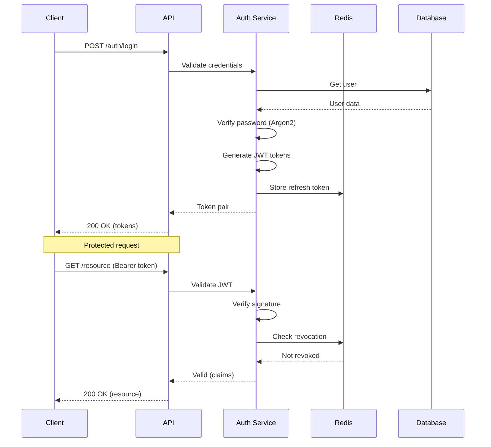

# Security Documentation

## Overview

Python API Base implements comprehensive security controls following OWASP API Security Top 10 guidelines.

## Security Controls

### Authentication

| Control | Implementation | Status |
|---------|----------------|--------|
| JWT Authentication | Access/Refresh tokens | ✅ |
| Token Expiration | 30min access, 7d refresh | ✅ |
| Token Revocation | Redis blacklist | ✅ |
| Password Hashing | Argon2 | ✅ |
| Password Policy | Configurable rules | ✅ |

### Authorization

| Control | Implementation | Status |
|---------|----------------|--------|
| RBAC | Role-based permissions | ✅ |
| Permission Composition | Hierarchical roles | ✅ |
| Resource-level Auth | Per-endpoint checks | ✅ |

### Input Validation

| Control | Implementation | Status |
|---------|----------------|--------|
| Schema Validation | Pydantic models | ✅ |
| Type Coercion | Strict mode | ✅ |
| Size Limits | Request body limits | ✅ |
| SQL Injection | Parameterized queries | ✅ |

### Security Headers

| Header | Value | Purpose |
|--------|-------|---------|
| `Content-Security-Policy` | `default-src 'self'` | XSS prevention |
| `X-Frame-Options` | `DENY` | Clickjacking prevention |
| `X-Content-Type-Options` | `nosniff` | MIME sniffing prevention |
| `Strict-Transport-Security` | `max-age=31536000` | HTTPS enforcement |
| `Referrer-Policy` | `strict-origin-when-cross-origin` | Referrer control |
| `Permissions-Policy` | `geolocation=()` | Feature restrictions |

## OWASP API Security Top 10 Compliance

### API1:2023 - Broken Object Level Authorization

**Mitigation:**
- Resource ownership validation in use cases
- RBAC permission checks
- Audit logging for access attempts

```python
async def get_item(item_id: str, current_user: User):
    item = await repository.get(item_id)
    if item.owner_id != current_user.id and "admin" not in current_user.roles:
        raise ForbiddenError("Access denied")
    return item
```

### API2:2023 - Broken Authentication

**Mitigation:**
- Strong password policy
- JWT with short expiration
- Token revocation support
- Rate limiting on auth endpoints

### API3:2023 - Broken Object Property Level Authorization

**Mitigation:**
- DTO-based responses (no entity exposure)
- Field-level permissions in DTOs
- Sensitive field filtering

### API4:2023 - Unrestricted Resource Consumption

**Mitigation:**
- Rate limiting per endpoint
- Request body size limits
- Pagination enforcement
- Query complexity limits

```python
@router.get("/items")
@rate_limit("10/minute")
async def list_items(
    page: int = Query(1, ge=1),
    page_size: int = Query(20, ge=1, le=100),
):
    ...
```

### API5:2023 - Broken Function Level Authorization

**Mitigation:**
- Role-based endpoint protection
- Permission decorators
- Admin-only routes separation

```python
@router.delete("/users/{user_id}")
@require_permission("users:delete")
async def delete_user(user_id: str, current_user: User):
    ...
```

### API6:2023 - Unrestricted Access to Sensitive Business Flows

**Mitigation:**
- Business logic rate limiting
- CAPTCHA for sensitive operations
- Multi-step verification

### API7:2023 - Server Side Request Forgery (SSRF)

**Mitigation:**
- URL validation and allowlisting
- No user-controlled URLs in server requests
- Network segmentation

### API8:2023 - Security Misconfiguration

**Mitigation:**
- Environment-based configuration
- Secrets management
- Security headers middleware
- Debug mode disabled in production

### API9:2023 - Improper Inventory Management

**Mitigation:**
- API versioning with deprecation
- OpenAPI documentation
- Endpoint inventory

### API10:2023 - Unsafe Consumption of APIs

**Mitigation:**
- External API validation
- Circuit breaker for external calls
- Response validation

## Authentication Flow



## Secrets Management

### Environment Variables

```bash
# Required secrets
SECURITY__SECRET_KEY=<min-32-chars>
DATABASE__URL=<connection-string>

# Optional secrets
REDIS__PASSWORD=<password>
KAFKA__SASL_PASSWORD=<password>
```

### Secret Rotation

1. Generate new secret
2. Update configuration
3. Restart services (rolling)
4. Revoke old tokens (if JWT secret)

## Audit Logging

```python
# Audit events logged
- Authentication attempts (success/failure)
- Authorization failures
- Resource access
- Data modifications
- Admin actions
```

## Security Checklist

### Development

- [ ] No secrets in code
- [ ] Input validation on all endpoints
- [ ] Output encoding
- [ ] Parameterized queries
- [ ] Error messages don't leak info

### Deployment

- [ ] HTTPS only
- [ ] Security headers configured
- [ ] Rate limiting enabled
- [ ] Debug mode disabled
- [ ] Secrets in secure storage

### Operations

- [ ] Regular security updates
- [ ] Log monitoring
- [ ] Incident response plan
- [ ] Penetration testing schedule

## Related Documentation

- [Authentication](../layers/infrastructure/auth.md)
- [RBAC](../layers/infrastructure/rbac.md)
- [Error Handling](../layers/interface/error-handling.md)
